<details>
<summary>Dit document is ook beschikbaar in andere talen</summary>

- [English](./README.en.md)
- [Español](./README.es.md)
- [Português](./README.pt.md)
- [Deutsch](./README.de.md)
- [中文](./README.zh.md)
- [हिन्दी](./README.hi.md)
- [العربية](./README.ar.md)
- [Italiano](./README.it.md)
- [Svenska](./README.sv.md)
- [Polski](./README.pl.md)
- [Nederlands](./README.nl.md)
- [Română](./README.ro.md)
- [日本語](./README.ja.md)
- [한국어](./README.ko.md)

</details>

# LeapMultix


[](https://www.codefactor.io/repository/github/jls42/leapmultix)
[](https://app.codacy.com/gh/jls42/leapmultix/dashboard?utm_source=gh&utm_medium=referral&utm_content=&utm_campaign=Badge_grade)
[](https://sonarcloud.io/summary/new_code?id=jls42_leapmultix)

[](https://sonarcloud.io/summary/new_code?id=jls42_leapmultix)
[](https://sonarcloud.io/summary/new_code?id=jls42_leapmultix)
[](https://sonarcloud.io/summary/new_code?id=jls42_leapmultix)
[](https://sonarcloud.io/summary/new_code?id=jls42_leapmultix)

[](https://sonarcloud.io/summary/new_code?id=jls42_leapmultix)
[](https://sonarcloud.io/summary/new_code?id=jls42_leapmultix)
[](https://sonarcloud.io/summary/new_code?id=jls42_leapmultix)
[](https://sonarcloud.io/summary/new_code?id=jls42_leapmultix)
[](https://sonarcloud.io/summary/new_code?id=jls42_leapmultix)

## Inhoudsopgave

- [Beschrijving](#beschrijving)
- [Overzicht](#-overzicht)
- [Functies](#-functies)
- [Snelle start](#-snelle-start)
- [Architectuur](#-architectuur)
- [Gedetailleerde spelmodi](#-gedetailleerde-spelmodi)
- [Ontwikkeling](#-ontwikkeling)
- [Compatibiliteit](#-compatibiliteit)
- [Lokalisatie](#-lokalisatie)
- [Opgenomen stem](#-opgenomen-stem)
- [Gegevensopslag](#-gegevensopslag)
- [Een probleem melden](#-een-probleem-melden)
- [Licentie](#-licentie)

## Beschrijving

LeapMultix is een interactieve educatieve webapplicatie bedoeld voor kinderen van 6 tot 12 jaar om de 4 rekenkundige bewerkingen onder de knie te krijgen: vermenigvuldigen (×), optellen (+), aftrekken (−) en delen (÷). Het biedt **5 spelmodi** en **4 arcade-minigames** in een intuïtieve, toegankelijke en meertalige interface.

**Ondersteuning voor meerdere bewerkingen:** alle vijf de modi ondersteunen de vier bewerkingen. De keuze wordt gemaakt op het startscherm en geldt voor het hele traject.

**Ontwikkeld door:** Julien LS (contact@jls42.org)

**Online URL:** https://leapmultix.jls42.org/

## 📸 Overzicht

### De schermen

|                                                                                                                     |                                                                                                                    |
| :-----------------------------------------------------------------------------------------------------------------: | :----------------------------------------------------------------------------------------------------------------: |
|                        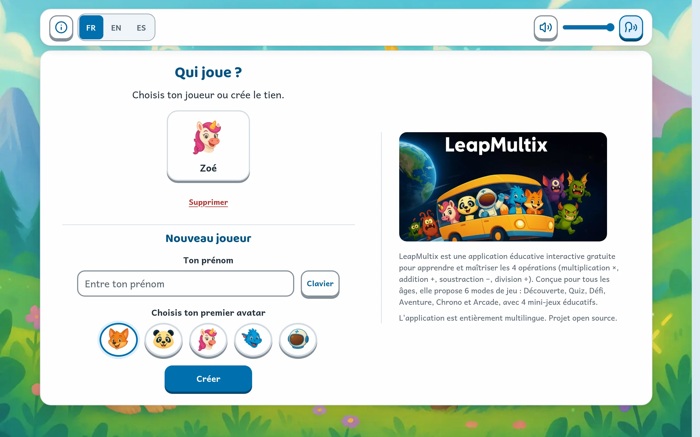                         |                   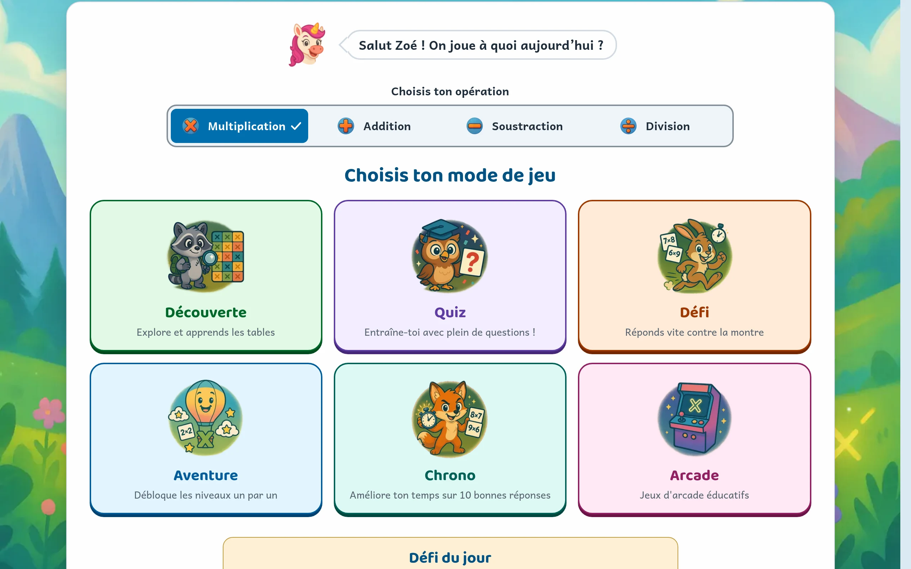                    |
|                         **Wie speelt er?** — een profiel per kind, met avatar en voortgang.                         |                   **Het menu** — hier kies je de bewerking, waarna de vijf modi worden geopend.                    |
|              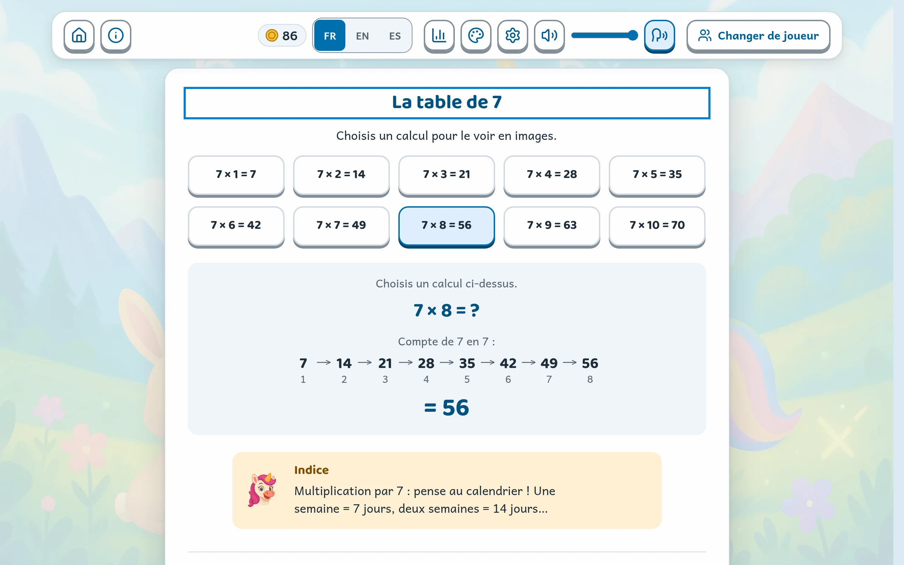              |            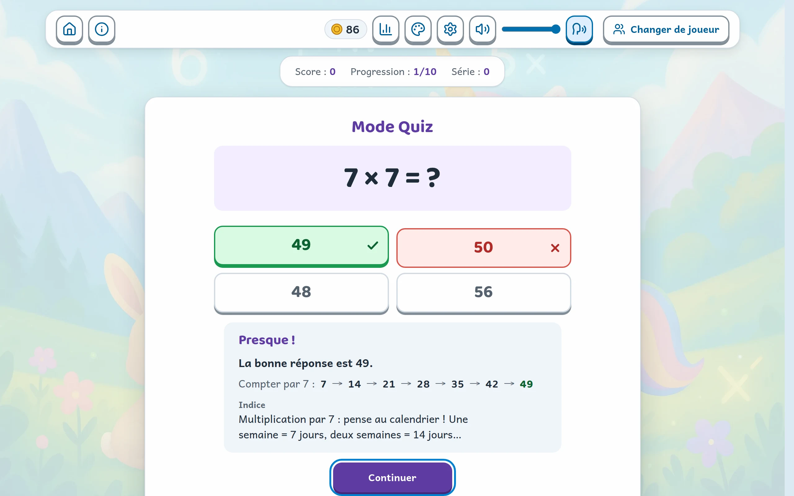            |
| **Ontdekking** — elke vergelijking wordt weergegeven in stippen, sprongen of tellen, met de rekentruc van de tafel. | **Quiz** — de keuze van het kind blijft zichtbaar naast het juiste antwoord, en de uitleg licht de berekening toe. |
|                       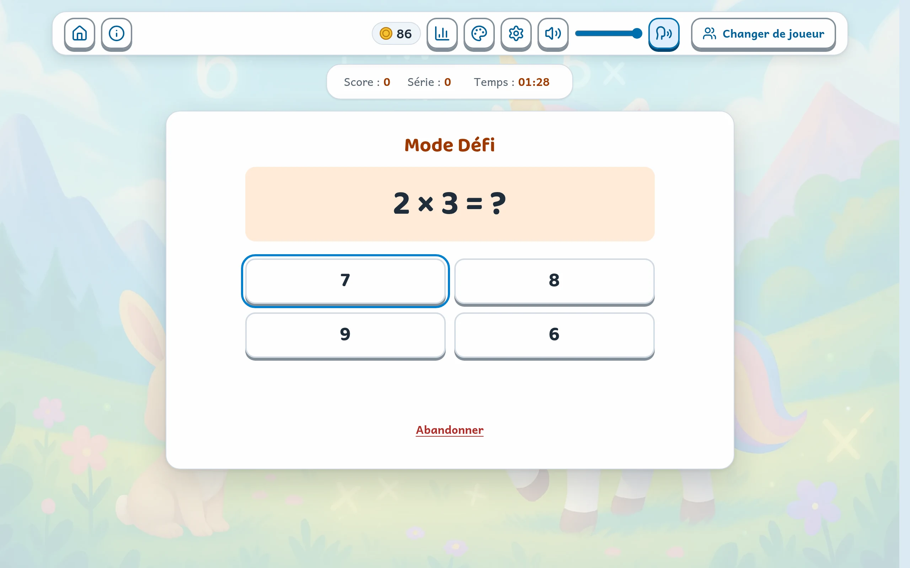                       |      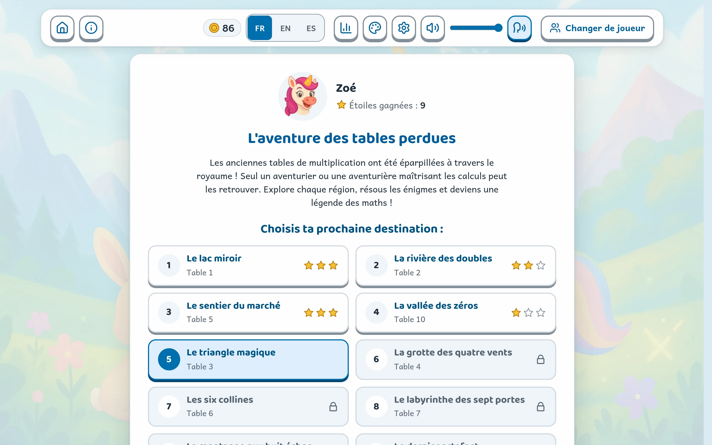       |
|  **Uitdaging** — race tegen de klok. Bij een fout pauzeert de timer zodat het juiste antwoord gelezen kan worden.   |                    **Avontuur** — tien niveaus die één voor één worden ontgrendeld met sterren.                    |
|                             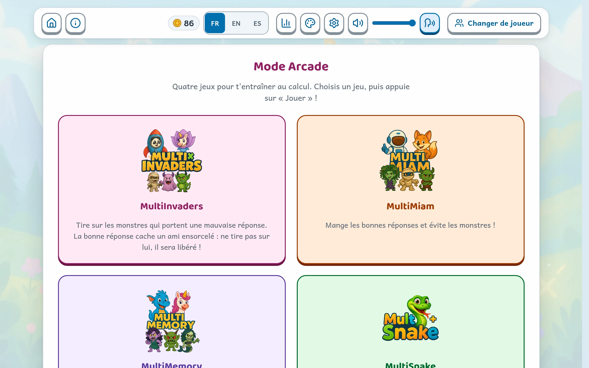                             |                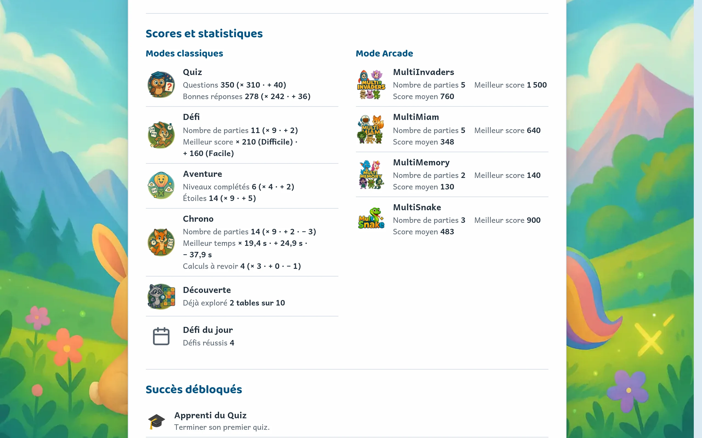                 |
|                   **Arcade** — vier minigames, met instelbare moeilijkheidsgraad en scheepskeuze.                   |                      **Dashboard** — sterren per tafel, te oefenen tafels, scores per modus.                       |
|               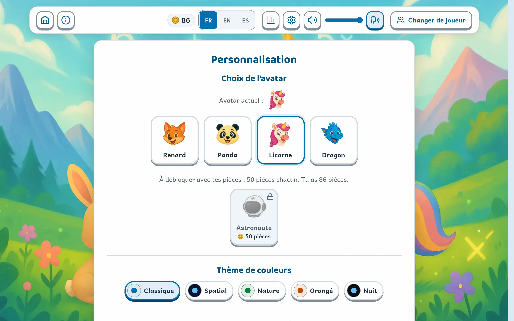                |                                                                                                                    |
|                    **Aanpassing** — avatar, kleurthema, tekstgrootte, hoog contrast, oudercode.                     |                                                                                                                    |

### De arcade-minigames

Vier spellen die dezelfde vraag stellen — weergegeven boven het speelveld, samen met de resterende tijd en levens — maar telkens een andere handeling vereisen.

|                                                                                                                                    |                                                                                                       |
| :--------------------------------------------------------------------------------------------------------------------------------: | :---------------------------------------------------------------------------------------------------: |
|           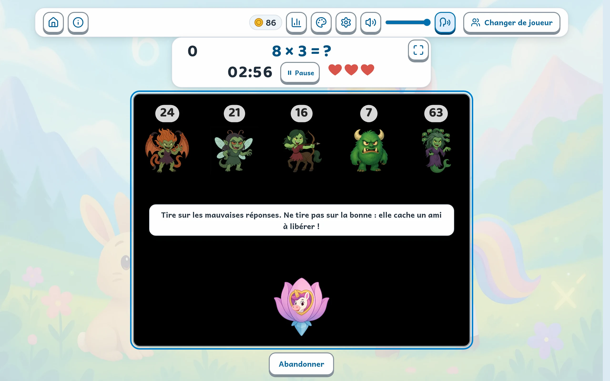           | 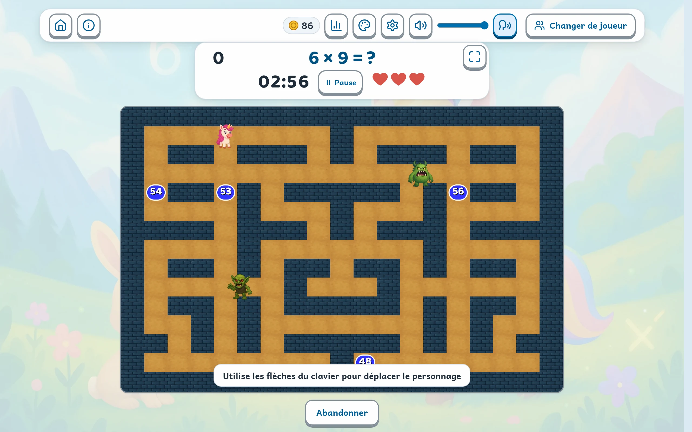 |
| **MultiInvaders** — schiet op de verkeerde antwoorden, spaar het juiste: daarin zit een vriendje verstopt dat bevrijd moet worden. |    **MultiMiam** — doorkruis het doolhof om het juiste resultaat te pakken en ontwijk de monsters.    |
|   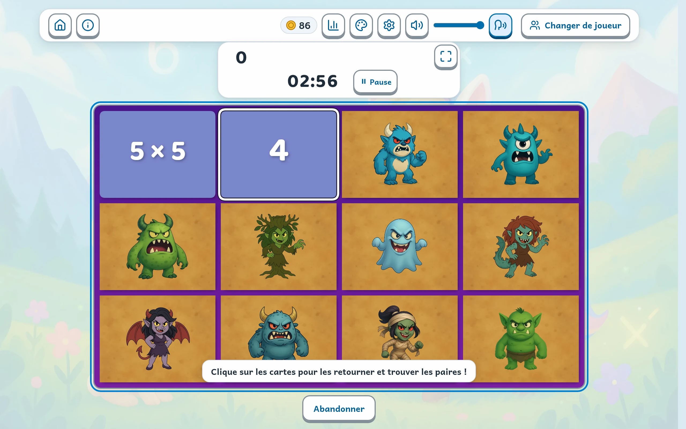    |      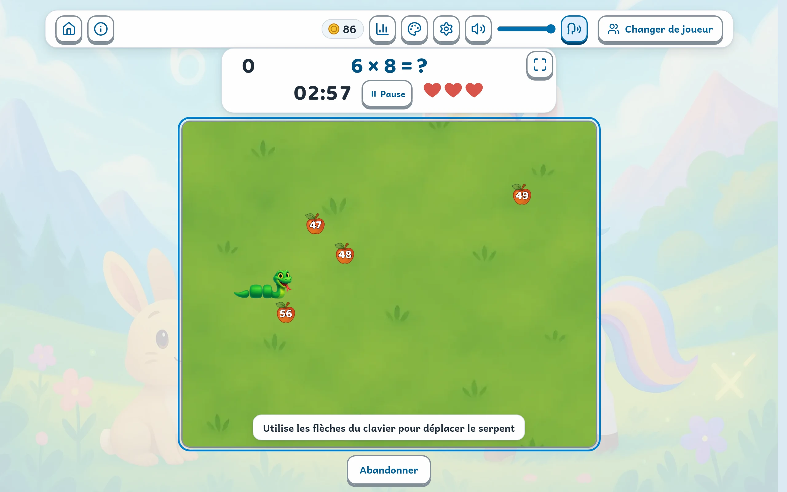      |
|               **MultiMemory** — vind uit het geheugen welke kaart het resultaat van de omgedraaide berekening toont.               |            **MultiSnake** — groei door de juiste getallen op te eten, ontwijk alle andere.            |

## ✨ Functies

### 🎮 Spelmodi

- **Ontdekkingsmodus**: Visuele en interactieve verkenning aangepast aan elke bewerking
- **Quizmodus**: Meerkeuzevragen met ondersteuning voor de 4 bewerkingen (×, +, −, ÷) en adaptieve voortgang
- **Uitdagingsmodus**: Race tegen de klok met de 4 bewerkingen (×, +, −, ÷) en verschillende moeilijkheidsgraden
- **Avonturenmodus**: Verhalende voortgang per niveau met ondersteuning voor de 4 bewerkingen

### 🕹️ Arcade-minigames

- **MultiInvaders**: Educatieve Space Invaders - Vernietig de verkeerde antwoorden
- **MultiMiam**: Wiskundige Pac-Man - Verzamel de juiste antwoorden
- **MultiMemory**: Geheugenspel - Koppel bewerkingen aan uitkomsten
- **MultiSnake**: Educatieve Snake - Groei door de juiste getallen te eten

### ➕ Ondersteuning voor meerdere bewerkingen

LeapMultix biedt een complete training voor de 4 rekenkundige bewerkingen in **alle modi**:

| Modus      | ×   | +   | −   | ÷   |
| ---------- | --- | --- | --- | --- |
| Quiz       | ✅  | ✅  | ✅  | ✅  |
| Uitdaging  | ✅  | ✅  | ✅  | ✅  |
| Ontdekking | ✅  | ✅  | ✅  | ✅  |
| Avontuur   | ✅  | ✅  | ✅  | ✅  |
| Arcade     | ✅  | ✅  | ✅  | ✅  |

### 🌍 Algemene functies

- **Meerdere gebruikers**: Beheer van individuele profielen met opgeslagen voortgang
- **Meertalig**: Ondersteuning voor Frans, Engels en Spaans
- **Aanpassing**: Avatars, kleurthema's, achtergronden
- **Toegankelijkheid**: Toetsenbordnavigatie, touch-ondersteuning, WCAG 2.1 AA-naleving
- **Opgenomen stem**: het spel kan vragen en aanmoedigingen voorlezen met een vooraf opgenomen synthetische stem, met automatische terugval op de stem van het apparaat. De stemmen bevinden zich niet in deze repository: de site leapmultix.jls42.org levert Lucie in het Frans, Sulafat in het Engels en Spaans, en naar keuze Jane in het Engels (zie [Opgenomen stem](#-opgenomen-stem))
- **Mobiel responsive**: Interface geoptimaliseerd voor tablets en smartphones
- **Voortgangssysteem**: Scores, badges, dagelijkse uitdagingen

## 🚀 Snelle start

### Vereisten

- Node.js (versie 16 of hoger)
- Een moderne webbrowser

### Installatie

```bash
# Cloner le projet
git clone https://github.com/jls42/leapmultix.git
cd leapmultix

# Installer les dépendances
npm install

# Lancer le serveur de développement (option 1)
npm run serve
# L'application sera accessible sur http://localhost:8080 (ou port suivant disponible)

# Ou avec Python (option 2)
python3 -m http.server 8000
# L'application sera accessible sur http://localhost:8000
```

### Beschikbare scripts

```bash
# Développement
npm run serve          # Serveur local (http://localhost:8080)
npm run lint           # Vérification du code avec ESLint
npm run lint:fix       # Correction automatique des problèmes ESLint
npm run format:check   # Vérifier le formatage du code (TOUJOURS avant commit)
npm run format         # Formater le code avec Prettier
npm run verify         # Quality gate: lint + test + coverage

# Tests
npm run test           # Lancer tous les tests (CJS)
npm run test:watch     # Tests en mode watch
npm run test:coverage  # Tests avec rapport de couverture
npm run test:core      # Tests des modules core uniquement
npm run test:integration # Tests d'intégration
npm run test:storage   # Tests du système de stockage
npm run test:esm       # Tests ESM (dossiers tests-esm/, Jest vm-modules)
npm run test:verbose   # Tests avec sortie détaillée
npm run test:pwa-offline # Test offline PWA (nécessite Puppeteer), après `npm run serve`

# Analyse et maintenance
npm run analyze:jsdoc  # Analyse de la documentation
npm run improve:jsdoc  # Amélioration automatique JSDoc
npm run audit:mobile   # Tests responsivité mobile
npm run audit:accessibility # Tests d'accessibilité
npm run dead-code      # Détection de code non utilisé
npm run analyze:globals # Analyse des variables globales
npm run analyze:dependencies # Analyse usage des dépendances
npm run verify:cleanup # Analyse combinée (dead code + globals)

# Gestion des assets
npm run assets:generate    # Générer les images responsives
npm run assets:backgrounds # Convertir les fonds en WebP
npm run assets:analyze     # Analyse des assets responsive
npm run assets:diff        # Comparaison des assets

# Internationalisation
npm run i18n:verify    # Vérifier la cohérence des clés de traduction
npm run i18n:unused    # Lister les clés de traduction non utilisées
npm run i18n:compare   # Comparer les traductions (en/es) avec fr.json (référence)

# Build & livraison
npm run build          # Build de prod (Rollup) + postbuild (dist/ complet)
npm run serve:dist     # Servir dist/ sur http://localhost:5000 (ou port disponible)

# PWA et Service Worker
npm run sw:disable     # Désactiver le service worker
npm run sw:fix         # Corriger les problèmes de service worker

# Voix enregistrée (poste du propriétaire, clips hors dépôt)
npm run voice:corpus       # Résumé des phrases dites, par langue
npm run voice:corpus:lock  # Mettre à jour le verrou du corpus
npm run voice:generate     # Générer les clips (ElevenLabs, Google ou Mistral)
npm run voice:check        # Contrôler les clips (fichiers, MP3, Whisper)
npm run voice:review       # Whisper, contrôle et page d'écoute en une commande
npm run voice:listen       # Page d'écoute : clips signalés, avant/après
npm run voice:publish      # Publier les clips et l'index de la langue
npm run voice:check-online # Vérifier les clips servis en ligne
```

## 🧱 Architectuur

### Bestandsstructuur

De JavaScript-modules staan **plat in `js/`**, op drie mappen na:
`core/`, `components/` en `modes/`. Het is dus de bestandsnaam die voor de
groepering zorgt (`arcade-*`, `multimiam-*`, `i18n*`…).

```
leapmultix/
├── index.html              # Application (navigation par slides)
├── modes.html              # Page publique : les modes de jeu
├── parents.html            # Page publique : guide parents et enseignants
├── pwa.html                # Page publique : installation hors ligne
├── offline.html            # Page servie hors ligne par le service worker
├── sw.js                   # Service worker (version alignée sur js/cache-updater.js)
├── deploy.sh               # Déploiement S3 + invalidation CloudFront
├── js/
│   ├── core/               # Socle applicatif
│   │   ├── GameMode.js, GameModeManager.js   # Classe de base des modes
│   │   ├── storage.js, userState.js          # Persistance et session
│   │   ├── audio.js, theme.js, parental.js   # Son, thèmes, contrôle parental
│   │   ├── eventBus.js, mainInit.js          # Événements, amorçage DOM
│   │   ├── adventure-data.js                 # Niveaux du mode Aventure
│   │   ├── mult-stats.js, challenge-stats.js, operation-stats.js
│   │   ├── daily-challenge.js, tablePreferences.js, stats-migration.js
│   │   ├── userUi.js, utils.js               # Utilitaires (source canonique)
│   │   └── operations/                       # Une classe par opération
│   │       ├── Operation.js, OperationRegistry.js
│   │       └── Multiplication.js, Addition.js, Subtraction.js, Division.js
│   ├── components/         # Composants d'interface
│   │   ├── topBar.js, infoBar.js, dashboard.js, customization.js
│   │   ├── operationSelector.js, operationModeAvailability.js
│   │   └── icons.js, tableSettingsModal.js
│   ├── modes/              # Les cinq modes de jeu
│   │   ├── DiscoveryMode.js, QuizMode.js, ChallengeMode.js
│   │   └── AdventureMode.js, ArcadeMode.js
│   ├── arcade*.js          # Orchestrateur et briques communes des mini-jeux
│   ├── multimiam*.js       # Mini-jeu Pac-Man (moteur, rendu, contrôles…)
│   ├── multisnake.js       # Mini-jeu Snake
│   ├── i18n.js, i18n-store.js                # Internationalisation
│   ├── security-utils.js, error-handlers.js, logger.js
│   ├── accessibility.js, keyboard-navigation.js, touch-support.js, speech.js
│   ├── voice-clips.js      # Lecteur de la voix enregistrée (repli : speech.js)
│   ├── slides.js, mode-orchestrator.js, lazy-loader.js, game-cleanup.js
│   ├── VideoManager.js, responsive-image-loader.js
│   ├── userManager.js, main-helpers.js, utils-es6.js, questionGenerator.js
│   └── main-es6.js, main.js, bootstrap.js, game.js   # Points d'entrée
├── css/                    # Feuilles de style (jetons de design : themes.css)
├── assets/
│   ├── images/             # Sources PNG (avatars, sprites, fonds)
│   ├── generated-images/   # Variantes responsives (généré, hors git)
│   ├── fonts/, sounds/, videos/, icons/, social/
│   └── translations/       # fr.json, en.json, es.json
├── tests/__tests__/        # Tests Jest (jsdom, et bout-en-bout via Puppeteer)
├── tests-esm/              # Tests Jest en modules ES (.mjs)
├── scripts/                # Génération d'assets, i18n, rapports
│   └── voice/              # Voix enregistrée : corpus, génération, écoute, publication
├── docs/media/             # Captures et animations du README
└── dist/                   # Build de production (généré)
```

### Technische architectuur

**Moderne ES6-modules**: Het project maakt gebruik van een modulaire architectuur met ES6-classes en native imports/exports.

**Herbruikbare componenten**: Interface opgebouwd met gecentraliseerde UI-componenten (TopBar, InfoBar, Dashboard, Customization).

**Lazy Loading**: Intelligent laden van modules op aanvraag via `lazy-loader.js` om de initiële prestaties te optimaliseren.

**Geünificeerd opslagsysteem**: Gecentraliseerde API voor het opslaan van gebruikersgegevens via LocalStorage met fallbacks.

**Gecentraliseerd audiobeheer**: Geluidsregeling met meertalige ondersteuning en voorkeuren per gebruiker.

**Event Bus**: Ontkoppelde communicatie via events tussen componenten voor een onderhoudbare architectuur.

**Navigatie via slides**: Navigatiesysteem gebaseerd op genummerde slides (slide0, slide1, enz.) met `goToSlide()`.

**Beveiliging**: XSS-beveiliging en sanitization via `security-utils.js` voor alle DOM-bewerkingen.

## 🎯 Gedetailleerde spelmodi

### Ontdekkingsmodus

Visuele verkenningsinterface voor de tafels van vermenigvuldiging met:

- Interactieve visualisatie van vermenigvuldigingen
- Animaties en geheugensteuntjes
- Educatief slepen en neerzetten
- Vrije voortgang per tafel

### Quizmodus

Meerkeuzevragen met:

- 10 vragen per sessie
- Adaptieve voortgang op basis van behaalde resultaten
- Virtueel numeriek toetsenbord
- Streak-systeem (reeks goede antwoorden)

### Uitdagingsmodus

Race tegen de klok met:

- 3 moeilijkheidsgraden (Beginner, Gemiddeld, Moeilijk)
- Tijdbonus voor goede antwoorden
- Levenssysteem
- Ranglijst van topscores

### Avonturenmodus

Verhalende voortgang met:

- 10 ontgrendelbare themaniveaus
- Interactieve kaart met visuele voortgang
- Meeslepend verhaal met personages
- Sterren- en beloningssysteem

### Arcade-minigames

Elke minigame biedt:

- Keuze van moeilijkheidsgraad en aanpassing
- Levenssysteem en score
- Toetsenbord- en touch-bediening
- Individuele ranglijsten per gebruiker

## 🔧 Ontwikkeling

### Ontwikkelingsworkflow

**Commit nooit rechtstreeks op main.** Het project werkt met feature-branches.

**1. Maak een branch aan**, `feat/` voor een functionaliteit, `fix/` voor een bugfix:

```bash
git checkout -b feat/nom-de-la-fonctionnalite
```

**2. Ontwikkel en controleer.** Formattering komt als eerste: de CI weigert het
nog voordat de tests worden uitgevoerd.

```bash
npm run format:check  # TOUJOURS en premier : la CI refuse un code non formaté
npm run format        # Formater si nécessaire
npm run lint          # Qualité du code
npm run test          # Tests
npm run test:coverage # Couverture
```

**3. Commit op de branch**, en push deze vervolgens:

```bash
git add .
git commit -m "feat: description de la fonctionnalité"
git push -u origin feat/nom-de-la-fonctionnalite
```

**4. Open een pull request** en wacht op de analyses: verify, Codacy,
CodeFactor en SonarCloud. Er wordt gecorrigeerd tot alles groen is alvorens te mergen.

**Commit-stijl**: Beknopte berichten, gebiedende wijs (bijv.: "Fix arcade init errors", "Refactor cache updater")

**Quality gate**: Zorg ervoor dat `npm run lint`, `npm test` en `npm run test:coverage` slagen vóór elke commit

### Componentarchitectuur

**GameMode (basisklasse)**: Alle modi erven over van een gemeenschappelijke klasse met gestandaardiseerde methoden.

**GameModeManager**: Gecentraliseerde orchestratie van het starten en beheren van de modi.

**UI-componenten**: TopBar, InfoBar, Dashboard en Customization bieden een consistente interface.

**Lazy Loading**: Modules worden op aanvraag geladen om de initiële prestaties te optimaliseren.

**Event Bus**: Ontkoppelde communicatie tussen componenten via het eventsysteem.

### Tests

Het project bevat een complete testsuite:

- Unittests van de core-modules
- Integratietests van de componenten
- Tests van de spelmodi
- Geautomatiseerde codedekking

```bash
npm test              # Tous les tests (CJS)
npm test:core         # Tests des modules centraux
npm test:integration  # Tests d'intégration
npm test:coverage     # Rapport de couverture
npm run test:esm      # Tests ESM (ex: components/dashboard) via vm-modules
```

### Productie-build

- **Rollup**: Bundelt `js/main-es6.js` in ESM met code-splitting en sourcemaps
- **Terser**: Automatische minificatie voor optimalisatie
- **Post-build**: Kopieert `css/` en `assets/`, de favicons (`favicon.ico`, `favicon.png`, `favicon.svg`), `sw.js`, en herschrijft `dist/index.html` naar het gehashte invoerbestand (bijv.: `main-es6-*.js`)
- **Eindmap**: `dist/` klaar om statisch te worden geserveerd

```bash
npm run build      # génère dist/
npm run serve:dist # sert dist/ (port 5000)
```

### Continue Integratie

**GitHub Actions**: `.github/workflows/ci.yml`, geactiveerd bij elke push naar
`main` en bij elke pull request.

**`verify`** — de kwaliteitscontrole, blokkerend:

- `npm ci` en vervolgens `npm run verify` (ESLint, Jest-tests, dekking)
- `npm run format:check` (Prettier)

**`seo-report`** — na `verify`: Lighthouse-audit van de live site, om
SEO-statistieken op de lange termijn te volgen.

**Externe analyses** gekoppeld aan de pull requests: Codacy, CodeFactor en
SonarCloud. De SonarCloud quality gate vereist score A voor betrouwbaarheid, beveiliging en
onderhoudbaarheid op nieuwe code.

**Implementatie**: `./deploy.sh` synchroniseert de site naar S3 en maakt de cache van
CloudFront ongeldig. Het script regenereert indien nodig de responsive afbeeldingen, die niet in git zijn opgenomen.

### PWA (Progressive Web App)

LeapMultix is een volwaardige PWA met offline-ondersteuning en installatiemogelijkheid.

**Service Worker** (`sw.js`):

- Navigatie: Network-first met offline fallback naar `offline.html`
- Afbeeldingen: Cache-first om de prestaties te optimaliseren
- Vertalingen: Stale-while-revalidate voor updates op de achtergrond
- JS/CSS: Network-first om altijd de nieuwste versie te leveren
- Automatisch versiebeheer via `cache-updater.js`

**Manifest** (`manifest.json`):

- SVG- en PNG-pictogrammen voor alle apparaten
- Installatie mogelijk op mobiel (Aan beginscherm toevoegen)
- Standalone-configuratie voor app-achtige ervaring
- Ondersteuning voor thema's en kleuren

**Offline-modus lokaal testen.** Start de server en open vervolgens
`http://localhost:8080` (of de weergegeven poort):

```bash
npm run serve
```

Handmatig: schakel het netwerk uit in de ontwikkelaarshulpprogramma's (tabblad Netwerk,
offline-modus) en vernieuw de pagina. `offline.html` moet worden weergegeven.

Automatisch, met Puppeteer:

```bash
npm run test:pwa-offline
```

**Beheerscripts voor de Service Worker**:

```bash
npm run sw:disable  # Désactiver le service worker
npm run sw:fix      # Corriger les problèmes de cache
```

### Kwaliteitsnormen

**Hulpmiddelen voor codekwaliteit**:

- **ESLint**: Moderne configuratie met flat config (`eslint.config.js`), ondersteuning voor ES2022
- **Prettier**: Automatische codeformattering (`.prettierrc`)
- **Stylelint**: CSS-validatie (`.stylelintrc.json`)
- **JSDoc**: Automatische documentatie van functies met dekkingsanalyse

**Belangrijke coderichtlijnen**:

- Ongebruikte variabelen en parameters verwijderen (`no-unused-vars`)
- Specifieke foutafhandeling gebruiken (geen lege catch-blokken)
- `innerHTML` vermijden ten gunste van `security-utils.js`-functies
- Een cognitieve complexiteit van < 15 handhaven voor functies
- Complexe functies opsplitsen in kleinere helpers

**Beveiliging**:

- **XSS-bescherming**: Gebruik de functies van `security-utils.js`:
  - `appendSanitizedHTML()` in plaats van `innerHTML`
  - `createSafeElement()` om veilige elementen te maken
  - `setSafeMessage()` voor tekstinhoud
- **Externe scripts**: Verplicht `crossorigin="anonymous"`-attribuut
- **Invoervalidatie**: Externe gegevens altijd sanitizen
- **Content Security Policy**: CSP-headers om scriptbronnen te beperken

**Toegankelijkheid**:

- WCAG 2.1 AA-conformiteit
- Volledige toetsenbordnavigatie
- Passende ARIA-rollen en labels
- Conforme kleurcontrasten

**Prestaties**:

- Lazy loading van modules via `lazy-loader.js`
- CSS-optimalisaties en responsieve assets
- Service Worker voor slimme caching
- Code splitting en minificatie in productie

## 📱 Compatibiliteit

### Ondersteunde browsers

De interface maakt gebruik van `oklch()` voor kleuren en van `:has()` voor contextuele toestanden, wat de ondergrens bepaalt:

- Chrome / Chromium 111+
- Edge 111+
- Firefox 121+
- Safari 15.4+

### Apparaten

- **Desktop**: Toetsenbord- en muisbediening
- **Tablets**: Geoptimaliseerde aanraakinterface
- **Smartphones**: Adaptief responsief design

### Toegankelijkheid

- Volledige toetsenbordnavigatie (Tab, pijltjestoetsen, Esc)
- ARIA-rollen en labels voor schermlezers
- Conforme kleurcontrasten
- Ondersteuning voor ondersteunende technologieën

## 🌍 Lokalisatie

Volledige meertalige ondersteuning:

- **Frans** (standaardtaal)
- **Engels**
- **Spaans**

### Vertalingsbeheer

**Vertaalbestanden:** `assets/translations/*.json`

**Formaat:**

```json
{
  "menu_start": "Commencer",
  "quiz_correct": "Bravo !",
  "arcade_invasion_title": "MultiInvaders"
}
```

### Beheerscripts voor i18n

**`npm run i18n:verify`** - Consistentie van vertaalsleutels controleren

**`npm run i18n:unused`** - Ongebruikte vertaalsleutels oplijsten

**`npm run i18n:compare`** - Vertaalbestanden vergelijken met fr.json (referentie)

Dit script (`scripts/compare-translations.cjs`) zorgt voor de synchronisatie van alle taalbestanden:

**Functionaliteiten:**

- Detectie van ontbrekende sleutels (wel aanwezig in fr.json, maar niet in andere talen)
- Detectie van overtollige sleutels (aanwezig in andere talen, maar niet in fr.json)
- Identificatie van lege waarden (`""`, `null`, `undefined`, `[]`)
- Controle van typeconsistentie (string vs. array)
- Afvlakken van geneste JSON-structuren naar puntnotatie (bijv. `arcade.multiMemory.title`)
- Genereren van een gedetailleerd consolerepport
- Opslaan van het JSON-rapport in `docs/translations-comparison-report.json`

**Voorbeelduitvoer:**

```
🔍 Analyse comparative des fichiers de traduction

📚 Langue de référence: fr.json
✅ fr.json: 570 clés

━━━━━━━━━━━━━━━━━━━━━━━━━━━━━━━━━━━━━━━━
📝 Analyse de en.json
━━━━━━━━━━━━━━━━━━━━━━━━━━━━━━━━━━━━━━━━

📊 Total de clés: 570
✅ Aucune clé manquante
✅ Aucune clé supplémentaire
✅ Aucune valeur vide

📊 RÉSUMÉ FINAL
  fr.json: 570 clés
  en.json: 570 clés
  es.json: 570 clés

✅ Tous les fichiers de traduction sont parfaitement synchronisés !
```

**Vertaaldekking:**

- Volledige gebruikersinterface
- Spelinstructies
- Fout- en feedbackberichten
- Beschrijvingen en contextuele hulp
- Verhalende inhoud van de Avontuur-modus
- Toegankelijkheids- en ARIA-labels

## 🔊 Opgenomen stem

Het spel leest vragen, aanmoedigingen en uitleg hardop voor. Het spreekt slechts een eindige reeks zinnen uit, ongeveer 7.400 per taal: deze kunnen dus voor eens en altijd worden opgenomen, waardoor er tijdens het spelen geen spraaksynthesedienst wordt aangeroepen. Zonder audioclips leest het spel voor met de stem van het apparaat.

### In deze repository: de applicatie, zonder de stemmen

De code kan vooraf opgenomen clips afspelen en bevat de pipeline die ze genereert. De clips zelf zijn niet inbegrepen, evenmin als de API-sleutels van de leveranciers: een fork of lokale installatie leest voor met de stem van het apparaat.

- **Automatische terugval** op de stem van het apparaat, zin voor zin: clip ontbreekt of geeft een foutmelding, het afspelen wordt geweigerd door de browser, de clip start niet binnen 1,5 seconde, of er wordt offline gewerkt zonder de clip in de cache.
- **Instellingen**: de stemknop in de bovenste balk schakelt het voorlezen in of uit; het selectievakje «Opgenomen stem» (Toegankelijkheid en bediening) kiest tussen de opgenomen stem en de stem van het apparaat. Dit verschijnt alleen in talen waarin een stem is gepubliceerd.
- **Offline**: reeds beluisterde clips blijven in de cache bewaard (service worker).
- **Waar het spel naar clips zoekt**: in de tag `<meta name="leapmultix-voice-base">`, die leeg is in de repository. Alleen de productie-implementatie schrijft daar `/voice/` in.

Met uw eigen clips op het systeem (gemaakt via de onderstaande pipeline, geplaatst naast het spel in `../leapmultix-voices`), zorgt de parameter `?voix=local` ervoor dat ze worden afgespeeld door de ontwikkelserver:

```bash
npm run voice:publish -- local --lang fr --audience all --default-on   # relie voice/ (ignoré par git) aux clips
npm run voice:publish -- local --lang en --audience all --default-on
npm run voice:publish -- local --lang en --version jane-v1-1 --audience all   # autre voix de l'anglais (menu « Voix »)
npm run serve
# puis ouvrir http://localhost:8080/index.html?voix=local
```

### Op leapmultix.jls42.org: de gehoste stemmen

De door de auteur aangeboden website levert opgenomen synthetische stemmen:

- in het Frans, **Lucie**, gemaakt met ElevenLabs (Eleven v3-model);
- in het Brits-Engels en Spaans (Spanje), **Sulafat**, gemaakt met Google Cloud Text-to-Speech (Chirp 3 HD-stem);
- in het Engels, naar keuze van de speler, **Jane**, gemaakt met Mistral AI (Voxtral TTS).

De clips staan in een privé-repository en in een speciale S3-bucket, geleverd via CloudFront op `/voice/*`. In de instellingen toont het menu «Stem» de beschikbare stemmen voor de taal als er meerdere zijn, en de vermelding vermeldt de dienst van de gehoorde stem.

### Clips genereren

De pipeline is gescript in `scripts/voice/` en draait op de machine van de eigenaar, nooit in de publieke CI. De leverancierssleutels (ElevenLabs voor het Frans, Google Cloud Text-to-Speech voor het Engels en Spaans, Mistral voor Jane) blijven in een bestand `.env` buiten de repository, doorgegeven via `node --env-file`: er komt geen enkele sleutel in git terecht. De Claude Code-skill [`generating-voice-clips`](.claude/skills/generating-voice-clips/SKILL.md) doorloopt de procedure stap voor stap (gates, akkoorden, hervattingen); details staan in [`docs/voix-enregistree.md`](docs/voix-enregistree.md).

1. **Schatten** van de resterende zinnen en de te betalen tekens (Eleven v3: ongeveer 0,53 credit per teken; Chirp 3 HD: $ 30 per miljoen tekens, het eerste miljoen van elke maand is gratis; Voxtral TTS: $ 16 per miljoen).
2. **Genereren**. Het opnieuw uitvoeren van hetzelfde commando gaat verder met wat er nog ontbreekt. Wanneer de credits op zijn, stopt het script netjes (code 3) zonder een halfgeschreven bestand achter te laten. `--max-total-chars` maximeert de gecumuleerde uitgaven van de release: elk betaald antwoord wordt direct na ontvangst geregistreerd in een logboek, dat een abrupte stop overleeft. Bij Google en Mistral, die geen uitleesbaar saldo tonen, is dit de enige beveiliging.
3. **Controleren**: elke zin heeft een bijbehorende clip en elk MP3-bestand is geldig. Whisper transcribeert vervolgens elke clip lokaal, en de controle meldt verkeerd verstane getallen en afwijkende speelduren. `voice:review` combineert Whisper, deze controle en de luisterpagina in één commando.
4. **Beluisteren** op de luisterpagina (`voice:listen`) van de gemelde clips en een steekproef van vrouwelijke vormen («une fois 7»), die Whisper niet kan onderscheiden. Elke clip heeft een selectievakje «opnieuw doen», waarmee deze aan de lijst met afgekeurde clips wordt toegevoegd.
5. **Opnieuw doen** van de afgekeurde clips (`--redo`) en Whisper opnieuw uitvoeren, en vervolgens elke clip voor en na vergelijken op een tweede pagina. Een clip die na twee of drie pogingen nog steeds verkeerd wordt uitgesproken, krijgt een geforceerde tekst in `SAID_OVERRIDES` (`scripts/voice/said-text.mjs`), bijvoorbeeld het getal voluit geschreven.
6. **Publiceren** van de clips, controleren of ze online bereikbaar zijn, en vervolgens de index van de taal publiceren, eerst voor testers (`?voix=test`).
7. **Openstellen** van de stem voor iedereen en deze vervolgens standaard inschakelen. De noodschakelaar (`voice:publish -- remove`) verwijdert een taal uit de index: het spel valt terug op de stem van het apparaat.

```bash
# 1. Estimer (sans frais)
npm run voice:generate -- --lang fr --dry-run
# 2. Générer (payant), plafond cumulé en caractères ; --reserve protège les crédits ElevenLabs
node --env-file=<fichier .env hors dépôt> scripts/voice/generate.mjs --lang fr --reserve 5000 --max-total-chars <plafond>
node --env-file=<fichier .env hors dépôt> scripts/voice/generate.mjs --lang en --max-total-chars <plafond>
# 3. Contrôler : Whisper (installé une fois : voir l'en-tête de whisper_transcribe.py), contrôle, page d'écoute
npm run voice:review -- --lang fr
npm run voice:check -- --lang fr --probe
# 4. Écouter sur la page indiquée (la liste « à refaire » va dans ecartes.txt)
# 5. Refaire (payant), puis comparer avant/après (Whisper ne transcrit que les clips refaits)
node --env-file=<fichier .env hors dépôt> scripts/voice/generate.mjs --lang fr --redo ecartes.txt --max-total-chars <plafond>
npm run voice:review -- --lang fr --compare ecartes.txt
# 6. Publier
npm run voice:publish -- clips --lang fr --bucket <bucket>
npm run voice:check-online -- --lang fr
npm run voice:publish -- index --lang fr --bucket <bucket> --distribution <id> --audience test
# 7. Ouvrir
npm run voice:publish -- index --lang fr --bucket <bucket> --distribution <id> --audience all --default-on
```

### Regel: een gewijzigde uitgesproken zin wordt opnieuw opgenomen vóór de ingebruikname

Elke uitgesproken zin is afkomstig uit de vertalingen (`assets/translations/{fr,en,es}.json`) en maakt deel uit van het corpus. Het wijzigen van een gesproken zin zorgt er dan ook voor dat de test van de corpusvergrendeling (`scripts/voice/corpus.lock.json`) mislukt. Voor een taal met een opgenomen stem worden de clips van de gewijzigde zinnen vervolgens gegenereerd, gecontroleerd en beluisterd, en daarna gepubliceerd **vóór** het mergen. Ten slotte wordt de vergrendeling bijgewerkt (`npm run voice:corpus:lock`). Zonder deze clips wordt de gewijzigde zin voorgelezen met de stem van het apparaat.

## 📊 Gegevensopslag

### Gebruikersgegevens

- Profielen en voorkeuren
- Voortgang per spelmodus
- Scores en statistieken van de arcadespellen
- Personalisatie-instellingen

### Technische functionaliteiten

- Lokale opslag (localStorage) met fallbacks
- Gegevensisolatie per gebruiker
- Automatische opslag van voortgang
- Automatische migratie van oude gegevens

## 🐛 Een probleem melden

Problemen kunnen worden gemeld via de GitHub-issues. Gelieve het volgende te vermelden:

- Gedetailleerde beschrijving van het probleem
- Stappen om het te reproduceren
- Browser en versie
- Screenshots indien relevant

## 💝 Het project steunen

**[☕ Doneren via PayPal](https://paypal.me/jls)**

## 📄 Licentie

Dit project is gelicentieerd onder de AGPL v3. Zie het bestand `LICENSE` voor meer details.

---

_LeapMultix — vrije educatieve applicatie om de vier hoofdbewerkingen te leren_
