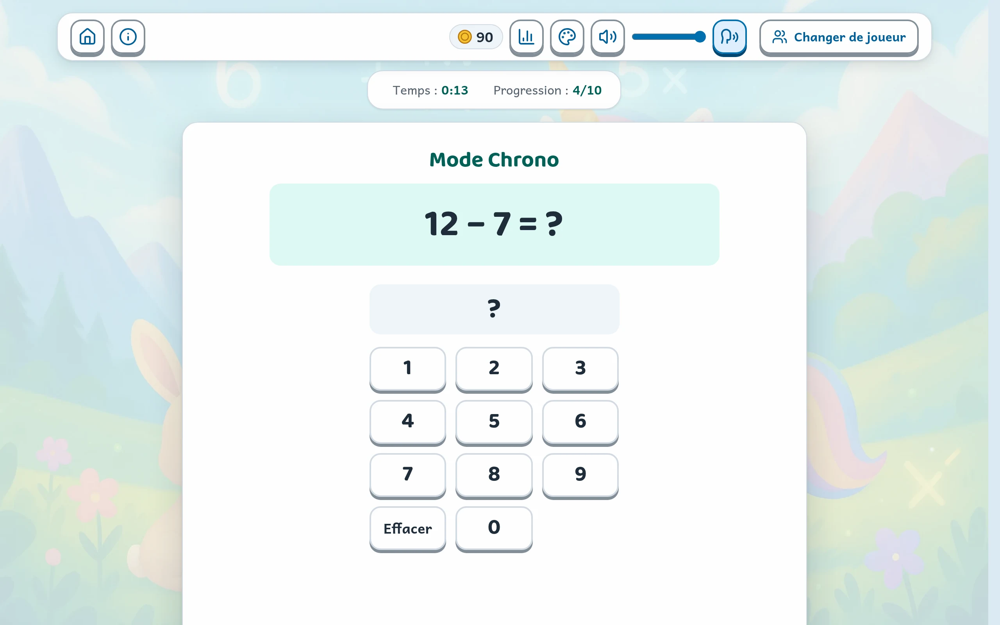

<details>
<summary>Detta dokument finns även på andra språk</summary>

- [Engelska](./README.en.md)
- [Spanska](./README.es.md)
- [Portugisiska](./README.pt.md)
- [Tyska](./README.de.md)
- [Kinesiska](./README.zh.md)
- [Hindi](./README.hi.md)
- [Arabiska](./README.ar.md)
- [Italienska](./README.it.md)
- [Svenska](./README.sv.md)
- [Polska](./README.pl.md)
- [Nederländska](./README.nl.md)
- [Rumänska](./README.ro.md)
- [Japanska](./README.ja.md)
- [Koreanska](./README.ko.md)

</details>

# LeapMultix


[](https://www.codefactor.io/repository/github/jls42/leapmultix)
[](https://app.codacy.com/gh/jls42/leapmultix/dashboard?utm_source=gh&utm_medium=referral&utm_content=&utm_campaign=Badge_grade)
[](https://sonarcloud.io/summary/new_code?id=jls42_leapmultix)

[](https://sonarcloud.io/summary/new_code?id=jls42_leapmultix)
[](https://sonarcloud.io/summary/new_code?id=jls42_leapmultix)
[](https://sonarcloud.io/summary/new_code?id=jls42_leapmultix)
[](https://sonarcloud.io/summary/new_code?id=jls42_leapmultix)

[](https://sonarcloud.io/summary/new_code?id=jls42_leapmultix)
[](https://sonarcloud.io/summary/new_code?id=jls42_leapmultix)
[](https://sonarcloud.io/summary/new_code?id=jls42_leapmultix)
[](https://sonarcloud.io/summary/new_code?id=jls42_leapmultix)
[](https://sonarcloud.io/summary/new_code?id=jls42_leapmultix)

## Innehållsförteckning

- [Beskrivning](#beskrivning)
- [Översikt](#-översikt)
- [Funktioner](#-funktioner)
- [Snabbstart](#-snabbstart)
- [Arkitektur](#-arkitektur)
- [Detaljerade spellägen](#-detaljerade-spellägen)
- [Utveckling](#-utveckling)
- [Kompatibilitet](#-kompatibilitet)
- [Lokalisering](#-lokalisering)
- [Inspelad röst](#-inspelad-röst)
- [Datalagring](#-datalagring)
- [Rapportera ett problem](#-rapportera-ett-problem)
- [Licens](#-licens)

## Beskrivning

LeapMultix är en interaktiv pedagogisk webbapplikation för barn mellan 6 och 12 år som vill lära sig de fyra räknesätten: multiplikation (×), addition (+), subtraktion (−) och division (÷). Den erbjuder **6 spellägen** och **4 minispel i arkadstil** i ett intuitivt, tillgängligt och flerspråkigt gränssnitt.

**Stöd för flera räknesätt:** alla lägen stöder de fyra räknesätten. Valet görs på startskärmen och gäller under hela spelsessionen.

**Utvecklad av:** Julien LS (contact@jls42.org)

**Webbadress:** https://leapmultix.jls42.org/

## 📸 Översikt

### Skärmarna

|                                                                                                                                             |                                                                                                        |
| :-----------------------------------------------------------------------------------------------------------------------------------------: | :----------------------------------------------------------------------------------------------------: |
|                                                                          |                                    |
|                                       **Vem spelar?** — en profil per barn, med avatar och framsteg.                                        |                       **Menyn** — här väljs först räknesätt och sedan spelläge.                        |
|                                                            |                               |
|                        **Upptäck** — varje likhet visas med punkter, hopp eller räkning samt ett knep för tabellen.                         | **Quiz** — barnets val visas bredvid det rätta svaret och förklaringen beskriver uträkningen i detalj. |
|                                                                     |         |
|                   **Utmaning** — tävla mot klockan. Vid ett fel stannar tiden så att barnet hinner läsa det rätta svaret.                   |                 **Äventyr** — tio nivåer som öppnas en efter en i utbyte mot stjärnor.                 |
|                                                |                                             |
|       **Tidtagning** — tio rätta svar mot klockan i det valda räknesättet; missade uträkningar läggs till i en lista för repetition.        |           **Arkad** — fyra minispel med inställning av svårighetsgrad och val av rymdskepp.            |
|                  |                  |
| **Instrumentpanel** — omgångar och rekord för varje läge, uppdelade efter räknesätt; stjärnor och tabeller att repetera för multiplikation. |       **Anpassning** — avatarer som låses upp med mynt, färgtema, textstorlek och hög kontrast.        |

### Minispelen i arkadstil

Fyra spel som ställer samma fråga — den som visas ovanför spelområdet
tillsammans med återstående tid och liv — men som varje gång kräver en
annan handling.

|                                                                                                                         |                                                                                          |
| :---------------------------------------------------------------------------------------------------------------------: | :--------------------------------------------------------------------------------------: |
|          |    |
|      **MultiInvaders** — skjut på de felaktiga svaren och skona det rätta: där gömmer sig en vän som ska befrias.       | **MultiMiam** — ta dig genom labyrinten för att fånga rätt resultat och undvik monstren. |
|  |       |
|                **MultiMemory** — kom ihåg vilket kort som visar resultatet av den uppvända uträkningen.                 |            **MultiSnake** — väx genom att äta rätt tal och undvik alla andra.            |

## ✨ Funktioner

### 🎮 Spellägen

- **Upptäckarläge**: Visuell och interaktiv utforskning anpassad till varje räknesätt
- **Quizläge**: Flervalsfrågor med stöd för de fyra räknesätten (×, +, −, ÷) och adaptiva framsteg
- **Utmaningsläge**: Tävling mot klockan med de fyra räknesätten (×, +, −, ÷) och olika svårighetsgrader
- **Äventyrsläge**: Berättelsedriven progression genom nivåer med stöd för de fyra räknesätten
- **Tidtagarläge**: 10 rätta svar mot en klocka som aldrig stannar för att slå den bästa tiden, med de fyra räknesätten (×, +, −, ÷)

### 🕹️ Minispel i arkadstil

- **MultiInvaders**: Pedagogiskt Space Invaders-spel – förstör de felaktiga svaren
- **MultiMiam**: Matematiskt Pac-Man-spel – samla in de rätta svaren
- **MultiMemory**: Memoryspel – para ihop räkneoperationer och resultat
- **MultiSnake**: Pedagogiskt Snake-spel – väx genom att äta rätt tal

### ➕ Stöd för flera räknesätt

LeapMultix erbjuder fullständig träning i de fyra räknesätten i **alla lägen**:

| Läge       | ×   | +   | −   | ÷   |
| ---------- | --- | --- | --- | --- |
| Quiz       | ✅  | ✅  | ✅  | ✅  |
| Utmaning   | ✅  | ✅  | ✅  | ✅  |
| Upptäck    | ✅  | ✅  | ✅  | ✅  |
| Äventyr    | ✅  | ✅  | ✅  | ✅  |
| Tidtagning | ✅  | ✅  | ✅  | ✅  |
| Arkad      | ✅  | ✅  | ✅  | ✅  |

### 🌍 Övergripande funktioner

- **Flera användare**: en profil per barn med individuella framsteg; på en klassrumsdator sorteras förnamnen, filtrering aktiveras från 10 spelare, papperskorgen sparar i 30 dagar och spelarna kan säkerhetskopieras till en fil
- **Flerspråkig**: Stöd för franska, engelska och spanska
- **Anpassning**: avatarer (den första kan väljas fritt, övriga låses upp med mynt som tjänas genom att spela och kostar 50 mynt styck), färgteman och bakgrunder
- **Tillgänglighet**: fullständig tangentbordsnavigering, stöd för pekskärm, paus i arkadläget, textstorlek och hög kontrast; kontrollerad med axe-core utan WCAG-överträdelser på nivå A eller AA på de granskade skärmarna
- **Inspelad röst**: spelet kan läsa upp frågor och uppmuntrande meddelanden med en förinspelad syntetisk röst och växlar automatiskt till enhetens röst vid behov. Rösterna finns inte i detta arkiv: webbplatsen leapmultix.jls42.org använder Lucie på franska, Sulafat på engelska och spanska samt valfritt Sulafat och Marie på franska och Jane på engelska (se [Inspelad röst](#-inspelad-röst))
- **Mobilanpassad**: Gränssnitt optimerat för surfplattor och smarttelefoner
- **Progressionssystem**: instrumentpanel per profil (omgångar, rekord och tabeller att repetera, uppdelade efter räknesätt), märken, dagliga utmaningar och mynt (i Tidtagning, Äventyr, Utmaning och Dagens utmaning)

## 🚀 Snabbstart

### Förutsättningar

- Node.js (version 16 eller senare)
- En modern webbläsare

### Installation

```bash
# Cloner le projet
git clone https://github.com/jls42/leapmultix.git
cd leapmultix

# Installer les dépendances
npm install

# Lancer le serveur de développement (option 1)
npm run serve
# L'application sera accessible sur http://localhost:8080 (ou port suivant disponible)

# Ou avec Python (option 2)
python3 -m http.server 8000
# L'application sera accessible sur http://localhost:8000
```

### Tillgängliga skript

```bash
# Développement
npm run serve          # Serveur local (http://localhost:8080)
npm run lint           # Vérification du code avec ESLint
npm run lint:fix       # Correction automatique des problèmes ESLint
npm run format:check   # Vérifier le formatage du code (TOUJOURS avant commit)
npm run format         # Formater le code avec Prettier
npm run verify         # Quality gate: lint + test + coverage

# Tests
npm run test           # Lancer tous les tests (CJS)
npm run test:watch     # Tests en mode watch
npm run test:coverage  # Tests avec rapport de couverture
npm run test:core      # Tests des modules core uniquement
npm run test:integration # Tests d'intégration
npm run test:storage   # Tests du système de stockage
npm run test:esm       # Tests ESM (dossiers tests-esm/, Jest vm-modules)
npm run test:verbose   # Tests avec sortie détaillée
npm run test:pwa-offline # Hors ligne de bout en bout (Puppeteer, serveur intégré)

# Analyse et maintenance
npm run analyze:jsdoc  # Analyse de la documentation
npm run improve:jsdoc  # Amélioration automatique JSDoc
npm run audit:mobile   # Tests responsivité mobile
npm run audit:accessibility # Tests d'accessibilité
npm run dead-code      # Détection de code non utilisé
npm run analyze:globals # Analyse des variables globales
npm run analyze:dependencies # Analyse usage des dépendances
npm run verify:cleanup # Analyse combinée (dead code + globals)

# Gestion des assets
npm run assets:generate    # Générer les images responsives
npm run assets:backgrounds # Convertir les fonds en WebP
npm run assets:analyze     # Analyse des assets responsive
npm run assets:diff        # Comparaison des assets

# Internationalisation
npm run i18n:verify    # Vérifier la cohérence des clés de traduction
npm run i18n:unused    # Lister les clés de traduction non utilisées
npm run i18n:compare   # Comparer les traductions (en/es) avec fr.json (référence)

# Build & livraison
npm run build          # Build de prod (Rollup) + postbuild (dist/ complet)
npm run serve:dist     # Servir dist/ sur http://localhost:5000 (ou port disponible)

# PWA et Service Worker
npm run sw:disable     # Désactiver le service worker
npm run sw:fix         # Corriger les problèmes de service worker

# Voix enregistrée (poste du propriétaire, clips hors dépôt)
npm run voice:corpus       # Résumé des phrases dites, par langue
npm run voice:corpus:lock  # Mettre à jour le verrou du corpus
npm run voice:generate     # Générer les clips (ElevenLabs, Google ou Mistral)
npm run voice:check        # Contrôler les clips (fichiers, MP3, Whisper)
npm run voice:review       # Whisper, contrôle et page d'écoute en une commande
npm run voice:listen       # Page d'écoute : clips signalés, avant/après
npm run voice:publish      # Publier les clips et l'index de la langue
npm run voice:check-online # Vérifier les clips servis en ligne
```

## 🧱 Arkitektur

### Filstruktur

JavaScript-modulerna ligger **på samma nivå i `js/`**, med undantag för tre mappar:
`core/`, `components/` och `modes/`. Det är alltså filnamnet som anger
grupperingen (`arcade-*`, `multimiam-*`, `i18n*`…).

```
leapmultix/
├── index.html              # Application (navigation par slides)
├── modes.html              # Page publique : les modes de jeu
├── parents.html            # Page publique : guide parents et enseignants
├── pwa.html                # Page publique : installation hors ligne
├── offline.html            # Page servie hors ligne par le service worker
├── sw.js                   # Service worker (version alignée sur js/cache-updater.js)
├── deploy.sh               # Déploiement S3 + invalidation CloudFront
├── js/
│   ├── core/               # Socle applicatif
│   │   ├── GameMode.js, GameModeManager.js   # Classe de base des modes
│   │   ├── storage.js, userState.js          # Persistance et session
│   │   ├── audio.js, theme.js                # Son, thèmes
│   │   ├── eventBus.js, mainInit.js          # Événements, amorçage DOM
│   │   ├── adventure-data.js                 # Niveaux du mode Aventure
│   │   ├── mult-stats.js, challenge-stats.js, operation-stats.js
│   │   ├── chrono-stats.js, chrono-questions.js, chrono-input.js   # Mode Chrono
│   │   ├── mode-stats.js, adventure-progress.js   # Compteurs du tableau de bord
│   │   ├── profile-operation-stats.js        # Statistiques par calcul, rangées dans le profil
│   │   ├── players-trash.js, players-backup.js   # Corbeille et sauvegarde des joueurs
│   │   ├── avatar-shop.js                    # Avatars débloqués avec les pièces (prix, achat)
│   │   ├── daily-challenge.js, tablePreferences.js, stats-migration.js
│   │   ├── userUi.js, utils.js               # Utilitaires (source canonique)
│   │   └── operations/                       # Une classe par opération
│   │       ├── Operation.js, OperationRegistry.js
│   │       └── Multiplication.js, Addition.js, Subtraction.js, Division.js
│   ├── components/         # Composants d'interface
│   │   ├── topBar.js, infoBar.js, dashboard.js, customization.js
│   │   ├── operationSelector.js, operationModeAvailability.js
│   │   ├── playerTools.js  # « Qui joue ? » sur un poste de classe : filtre, corbeille, sauvegarde
│   │   ├── loadErrorNotice.js   # Avis d'un jeu qui n'a pas pu s'ouvrir (hors ligne…)
│   │   ├── confirm-dialog.js, avatarShop.js   # Fenêtre de confirmation du jeu, boutique d'avatars
│   │   └── icons.js, tableSettingsModal.js
│   ├── modes/              # Les six modes de jeu
│   │   ├── DiscoveryMode.js, QuizMode.js, ChallengeMode.js
│   │   └── AdventureMode.js, ChronoMode.js, ArcadeMode.js
│   ├── arcade*.js          # Orchestrateur et briques communes des mini-jeux (temps et pause :
│   │                       #   arcade-time.js ; plein écran : arcade-fullscreen.js)
│   ├── multimiam*.js       # Mini-jeu Pac-Man (moteur, rendu, contrôles…)
│   ├── multisnake.js       # Mini-jeu Snake
│   ├── i18n.js, i18n-store.js                # Internationalisation
│   ├── security-utils.js, error-handlers.js, logger.js
│   ├── accessibility.js, keyboard-navigation.js, touch-support.js, speech.js
│   ├── voice-clips.js      # Lecteur de la voix enregistrée (repli : speech.js)
│   ├── slides.js, mode-orchestrator.js, lazy-loader.js, game-cleanup.js
│   ├── game-exit.js        # Une seule règle pour quitter une partie en cours
│   ├── VideoManager.js, responsive-image-loader.js
│   ├── userManager.js, main-helpers.js, utils-es6.js, questionGenerator.js
│   └── main-es6.js, main.js, bootstrap.js, game.js   # Points d'entrée
├── css/                    # Feuilles de style (jetons de design : themes.css)
├── assets/
│   ├── images/             # Sources PNG (avatars, sprites, fonds)
│   ├── generated-images/   # Variantes responsives (généré, hors git)
│   ├── fonts/, sounds/, videos/, icons/, social/
│   └── translations/       # fr.json, en.json, es.json
├── tests/__tests__/        # Tests Jest (jsdom, et bout-en-bout via Puppeteer)
├── tests-esm/              # Tests Jest en modules ES (.mjs)
├── scripts/                # Génération d'assets, i18n, rapports
│   ├── precache-list.mjs   # Liste de préchargement hors ligne de sw.js (npm run precache:update)
│   └── voice/              # Voix enregistrée : corpus, génération, écoute, publication
├── docs/media/             # Captures et animations du README
└── dist/                   # Build de production (généré)
```

### Teknisk arkitektur

**Moderna ES6-moduler**: Projektet använder en modulär arkitektur med ES6-klasser och inbyggda imports/exports.

**Återanvändbara komponenter**: Gränssnittet är byggt med centraliserade UI-komponenter (TopBar, InfoBar, Dashboard, Customization).

**Lazy Loading**: Intelligent inläsning av moduler vid behov via `lazy-loader.js` för att optimera den inledande prestandan.

**Enhetligt lagringssystem**: Centraliserat API för beständig lagring av användardata via LocalStorage med reservlösningar.

**Centraliserad ljudhantering**: Ljudkontroll med flerspråkigt stöd och inställningar per användare.

**Event Bus**: Frikopplad händelsebaserad kommunikation mellan komponenter för en underhållbar arkitektur.

**Bildbaserad navigering**: Navigeringssystem baserat på numrerade bilder (slide0, slide1 osv.) med `goToSlide()`.

**Säkerhet**: XSS-skydd och sanering via `security-utils.js` för all DOM-manipulation.

## 🎯 Detaljerade spellägen

### Upptäckarläge

Visuellt utforskningsgränssnitt anpassat till varje räknesätt, med:

- Interaktiv visualisering av multiplikationer
- Animationer och minnesstöd
- Pedagogisk dra-och-släpp-funktion
- Fri progression per tabell

### Quizläge

Flervalsfrågor med:

- 10 frågor per session
- Adaptiv progression efter resultaten
- Virtuellt numeriskt tangentbord
- System för sviter (flera rätta svar i rad)

### Utmaningsläge

Tävling mot klockan med:

- 3 svårighetsgrader (Nybörjare, Medel, Svår)
- Tidsbonus för rätta svar
- Livsystem
- Topplista över de bästa resultaten

### Äventyrsläge

Berättelsedriven progression med:

- 10 tematiska nivåer som kan låsas upp
- Interaktiv karta med visuell progression
- Fängslande berättelse med karaktärer
- System med stjärnor och belöningar

### Tidtagarläge

Tio rätta svar så snabbt som möjligt mot en klocka som aldrig stannar:

- De fyra räknesätten: multiplikationstabellerna (inställda i Tabellinställningar) samt
  alla additionstabeller (7 + k), subtraktionstabeller ((7 + k) − 7) och divisionstabeller ((7 × k) ÷ 7)
- Svar via alternativ eller numeriskt tangentbord, med klick eller tangentbord
- Bästa tider, genomsnittstid och kurva över de senaste omgångarna, per räknesätt
- ”Mina uträkningar att repetera”: en lista per räknesätt som övas i båda riktningarna (6 × 7 och 7 × 6,
  15 − 7 och 15 − 8)

### Instrumentpanel

Vad barnet faktiskt har spelat, profil för profil:

- Stjärnor från Äventyret och multiplikationstabeller att repetera (de 20 senaste svaren i varje tabell)
- Frågor och rätta svar i Quiz, Utmaning, Äventyr och Tidtagning
- Omgångar och rekord i varje läge och minispel, inklusive avbrutna omgångar, uppdelade efter räknesätt
  så snart barnet övar på flera

### Minispel i arkadstil

Varje minispel erbjuder:

- Tre svårighetsgrader i de fyra räknesätten
- Liv- och poängsystem
- Styrning med mus, tangentbord och finger, beskriven på spelets informationssida
- Paus: knapp bredvid tiden eller tangenten P; spelet pausas också när fliken
  döljs och återupptas aldrig automatiskt
- MultiMemory: möjlighet att spela utan tidsgräns
- Spelplan som utnyttjar det tillgängliga utrymmet (högre än bred på en telefon i stående läge) och helskärmsläge,
  både på dator och telefon, även när telefonen roteras (utom på iPhone, vars webbläsare
  inte tillåter det)
- Varje spelares bästa resultat; ”Nollställ” anger allt som raderas

## 🔧 Utveckling

### Utvecklingsflöde

**Committa aldrig direkt till main.** Projektet arbetar med separata
funktionsgrenar.

**1. Skapa en gren**, `feat/` för en funktion, `fix/` för en korrigering:

```bash
git checkout -b feat/nom-de-la-fonctionnalite
```

**2. Utveckla och verifiera.** Formateringen kommer först: CI avvisar den
innan testerna ens körs.

```bash
npm run format:check  # TOUJOURS en premier : la CI refuse un code non formaté
npm run format        # Formater si nécessaire
npm run lint          # Qualité du code
npm run test          # Tests
npm run test:coverage # Couverture
```

**3. Committa på grenen** och pusha den sedan:

```bash
git add .
git commit -m "feat: description de la fonctionnalité"
git push -u origin feat/nom-de-la-fonctionnalite
```

**4. Öppna en pull request** och invänta analyserna: verify, Codacy,
CodeFactor och SonarCloud. Åtgärda problemen tills allt är grönt innan sammanslagning.

**Commitstil**: Korta meddelanden i imperativ form (t.ex. "Fix arcade init errors", "Refactor cache updater")

**Quality gate**: Säkerställ att `npm run lint`, `npm test` och `npm run test:coverage` godkänns före varje commit

### Komponentarkitektur

**GameMode (basklass)**: Alla lägen ärver från en gemensam klass med standardiserade metoder.

**GameModeManager**: Centraliserad orkestrering av start och hantering av lägen.

**UI-komponenter**: TopBar, InfoBar, Dashboard och Customization ger ett enhetligt gränssnitt.

**Lazy Loading**: Moduler läses in vid behov för att optimera den inledande prestandan.

**Event Bus**: Frikopplad kommunikation mellan komponenter via händelsesystemet.

### Tester

Projektet innehåller en komplett testsvit:

- Enhetstester för core-moduler
- Integrationstester för komponenter
- Tester av spellägen
- Automatisk kodtäckning

```bash
npm test              # Tous les tests (CJS)
npm test:core         # Tests des modules centraux
npm test:integration  # Tests d'intégration
npm test:coverage     # Rapport de couverture
npm run test:esm      # Tests ESM (ex: components/dashboard) via vm-modules
```

### Produktionsbygge

- **Rollup**: Paketerar `js/main-es6.js` i ESM med code-splitting och sourcemaps
- **Terser**: Automatisk minifiering för optimering
- **Post-build**: Kopierar `css/` och `assets/`, favicons (`favicon.ico`, `favicon.png`, `favicon.svg`), `sw.js` samt skriver om `dist/index.html` till den hashade startfilen (t.ex. `main-es6-*.js`)
- **Slutlig mapp**: `dist/` redo att serveras statiskt

```bash
npm run build      # génère dist/
npm run serve:dist # sert dist/ (port 5000)
```

### Kontinuerlig integration

**GitHub Actions**: `.github/workflows/ci.yml`, utlöses vid varje push till
`main` och vid varje pull request.

**`verify`** – den blockerande kvalitetsgrinden:

- `npm ci` och sedan `npm run verify` (ESLint, Jest-tester, täckning)
- `npm run format:check` (Prettier)

**`seo-report`** – efter `verify`: Lighthouse-granskning av den publicerade webbplatsen för
att följa SEO-mätvärden över tid.

**Externa analyser** kopplade till pull requests: Codacy, CodeFactor och
SonarCloud. SonarCloud-grinden kräver betyget A för tillförlitlighet, säkerhet och
underhållbarhet för ny kod.

**Driftsättning**: `./deploy.sh` synkroniserar webbplatsen till S3 och ogiltigförklarar
CloudFront-cachen. Skriptet återskapar vid behov responsiva bilder som saknas i git.

### PWA (Progressive Web App)

LeapMultix är en komplett PWA med offlinestöd och möjlighet till installation.

**Service Worker** (`sw.js`):

- Installation: förinläsning av allt som spelet behöver, med en lista som skapas från koden
  av `scripts/precache-list.mjs` (`npm run precache:update`, verifierad av testerna): efter
  ett första besök kan de 6 lägena och de 4 Arcade-spelen startas offline
- Navigering: Network-first; offline används den cachade spelsidan (`offline.html` endast
  för en sida som aldrig har sparats)
- Bilder: Cache-first; offline används en annan storlek av samma sprite eller en annan bakgrund för samma avatar
- Översättningar: Stale-while-revalidate för uppdatering i bakgrunden
- JS/CSS: Network-first för att alltid leverera den senaste versionen, med offlinecache
- Ljud och typsnitt: Cache-first, byteintervall levereras (Safaris ljudspelare)
- Automatisk versionshantering via `cache-updater.js`

**Manifest** (`manifest.json`):

- SVG- och PNG-ikoner för alla enheter
- Kan installeras på mobila enheter (Add to Home Screen)
- Standalone-konfiguration för en applikanande upplevelse
- Stöd för teman och färger

**Testa offlineläget lokalt.** Starta servern och öppna sedan
`http://localhost:8080` (eller den port som visas):

```bash
npm run serve
```

Manuellt: låt sidan vara öppen tills service workern har registrerat spelet, stoppa
servern (eller stäng av enhetens nätverk) och uppdatera sedan sidan. Spelet ska
visas och varje läge ska kunna startas.

Automatiskt med Puppeteer:

```bash
npm run test:pwa-offline
```

**Skript för hantering av Service Worker**:

```bash
npm run sw:disable  # Désactiver le service worker
npm run sw:fix      # Corriger les problèmes de cache
```

### Kvalitetsstandarder

**Verktyg för kodkvalitet**:

- **ESLint**: Modern konfiguration med flat config (`eslint.config.js`), stöd för ES2022
- **Prettier**: Automatisk kodformatering (`.prettierrc`)
- **Stylelint**: CSS-validering (`.stylelintrc.json`)
- **JSDoc**: Automatisk dokumentation av funktioner med täckningsanalys

**Viktiga kodregler**:

- Ta bort oanvända variabler och parametrar (`no-unused-vars`)
- Använd specifik felhantering (inga tomma catch-block)
- Undvik `innerHTML` till förmån för funktionerna `security-utils.js`
- Håll funktioners kognitiva komplexitet under 15
- Bryt ut komplexa funktioner i mindre helpers

**Säkerhet**:

- **XSS-skydd**: Använd funktionerna i `security-utils.js`:
  - `appendSanitizedHTML()` i stället för `innerHTML`
  - `createSafeElement()` för att skapa säkra element
  - `setSafeMessage()` för textinnehåll
- **Externa skript**: Attributet `crossorigin="anonymous"` är obligatoriskt
- **Indatavalidering**: Sanera alltid externa data
- **Content Security Policy**: CSP-headers för att begränsa skriptkällor

**Tillgänglighet**:

- Målet är WCAG 2.1 nivå AA, kontrollerat med axe-core: inga överträdelser på nivå A eller AA och inga
  överträdelser av god praxis
- Fullständig tangentbordsnavigering
- ARIA-roller och tillgängliga namn
- Kontraster verifierade med axe-core

**Prestanda**:

- Lazy loading av moduler via `lazy-loader.js`
- CSS-optimeringar och responsiva assets
- Service Worker för intelligent cachning
- Code splitting och minifiering i produktion

## 📱 Kompatibilitet

### Webbläsare som stöds

Gränssnittet använder `oklch()` för färger och `:has()` för
kontextuella tillstånd, vilket anger minimikraven:

- Chrome / Chromium 111+
- Edge 111+
- Firefox 121+
- Safari 15.4+

### Enheter

- **Desktop**: Styrning med tangentbord och mus
- **Surfplattor**: Optimerat pekgränssnitt
- **Smartphones**: Anpassningsbar responsiv design

### Tillgänglighet

- Fullständig tangentbordsnavigering: Tab, piltangenter i svarsrutnäten och på korten i
  MultiMemory, Retur, Escape; länken ”Gå till spellägena” högst upp på startsidan
- En enda regel för att lämna en omgång: ”Ge upp”, Escape eller en knapp i det övre fältet
  ställer samma fråga, och om barnet avböjer fortsätter omgången
- Skärmläsare: varje svar är kopplat till sin fråga, en rubrik på nivå 1 per vy och
  meddelandena läses upp
- Sidan kan zoomas med fingrarna (utom i Arcade-spelen); textstorlek, hög kontrast,
  minskade animationer och ett lästypsnitt baserat på Andika, utformat för
  nybörjarläsare
- Arcade: paus (knapp, P-tangenten eller dold flik); valfri avsaknad av tidsgräns i MultiMemory
- Kontrollerat med axe-core (WCAG 2.0 till 2.2, nivå A och AA samt god praxis): inga
  överträdelser på 40 vyer i datorbredd och 39 i telefonbredd (390 px), inklusive temat
  Natt och hög kontrast

## 🌍 Lokalisering

Fullständigt flerspråkigt stöd:

- **Franska** (standardspråk)
- **Engelska**
- **Spanska**

### Hantering av översättningar

**Översättningsfiler:** `assets/translations/*.json`

**Format:**

```json
{
  "menu_start": "Commencer",
  "quiz_correct": "Bravo !",
  "arcade_invasion_title": "MultiInvaders"
}
```

### Skript för i18n-hantering

**`npm run i18n:verify`** – Kontrollera att översättningsnycklarna är konsekventa

**`npm run i18n:unused`** – Lista oanvända översättningsnycklar

**`npm run i18n:compare`** – Jämför översättningsfilerna med fr.json (referens)

Detta skript (`scripts/compare-translations.cjs`) ser till att alla språkfiler är synkroniserade:

**Funktioner:**

- Identifiering av saknade nycklar (finns i fr.json men saknas i andra språk)
- Identifiering av extra nycklar (finns i andra språk men inte i fr.json)
- Identifiering av tomma värden (`""`, `null`, `undefined`, `[]`)
- Kontroll av typkonsekvens (string kontra array)
- Utplattning av nästlade JSON-strukturer till punktnotation (t.ex. `arcade.multiMemory.title`)
- Generering av en detaljerad konsolrapport
- Lagring av JSON-rapporten i `docs/translations-comparison-report.json`

**Exempel på utdata:**

```
🔍 Analyse comparative des fichiers de traduction

📚 Langue de référence: fr.json
✅ fr.json: 570 clés

━━━━━━━━━━━━━━━━━━━━━━━━━━━━━━━━━━━━━━━━
📝 Analyse de en.json
━━━━━━━━━━━━━━━━━━━━━━━━━━━━━━━━━━━━━━━━

📊 Total de clés: 570
✅ Aucune clé manquante
✅ Aucune clé supplémentaire
✅ Aucune valeur vide

📊 RÉSUMÉ FINAL
  fr.json: 570 clés
  en.json: 570 clés
  es.json: 570 clés

✅ Tous les fichiers de traduction sont parfaitement synchronisés !
```

**Översättningstäckning:**

- Fullständigt användargränssnitt
- Spelinstruktioner
- Fel- och återkopplingsmeddelanden
- Beskrivningar och kontextuell hjälp
- Berättande innehåll i Äventyrsläget
- Tillgänglighets- och ARIA-etiketter

## 🔊 Inspelad röst

Spelet läser upp frågor, uppmuntran och förklaringar. Det använder endast en begränsad uppsättning fraser, cirka 7 400 per språk: de kan därför spelas in en gång för alla, och ingen omgång behöver då anropa någon talsyntestjänst. Utan klipp läser spelet upp texten med enhetens röst.

### I detta repository: applikationen utan rösterna

Koden kan spela upp förinspelade klipp och innehåller kedjan som skapar dem. Varken klippen eller leverantörernas nycklar finns här: en fork eller lokal installation använder enhetens röst.

- **Automatisk fallback** till enhetens röst, fras för fras: om ett klipp saknas eller ger fel, om webbläsaren nekar uppspelning, om klippet inte startar inom 1,5 s eller vid offlineläge utan klippet i cachen.
- **Inställningar**: röstknappen i det övre fältet slår på eller stänger av uppläsningen; kryssrutan ”Inspelad röst” (Tillgänglighet och styrning) väljer mellan den inspelade rösten och enhetens röst. Den visas endast för språk där en röst har publicerats.
- **Offline**: klipp som redan har hörts ligger kvar i cachen (service worker).
- **Var spelet söker efter klippen**: i taggen `<meta name="leapmultix-voice-base">`, som är tom i repositoryt. Endast produktionsdriftsättningen skriver `/voice/` där.

Med egna lokala klipp (skapade med kedjan nedan och placerade bredvid spelet i `../leapmultix-voices`) gör parametern `?voix=local` att utvecklingsservern spelar upp dem:

```bash
npm run voice:publish -- local --lang fr --audience all --default-on   # relie voice/ (ignoré par git) aux clips
npm run voice:publish -- local --lang en --audience all --default-on
npm run voice:publish -- local --lang en --version jane-v1-1 --audience all   # autre voix de l'anglais (menu « Voix »)
npm run serve
# puis ouvrir http://localhost:8080/index.html?voix=local
```

### På leapmultix.jls42.org: rösterna från webbhotellet

Webbplatsen som tillhandahålls av upphovspersonen erbjuder inspelade syntetiska röster:

- på franska **Lucie**, skapad med ElevenLabs (modellen Eleven v3);
- på brittisk engelska och spanska från Spanien **Sulafat**, skapad med Google Cloud Text-to-Speech (rösten Chirp 3 HD);
- som spelarens val **Sulafat** på franska, för att behålla samma röst på alla tre språken;
- också som spelarens val **Marie** på franska och **Jane** på engelska, skapade med Mistral AI (Voxtral TTS).

Klippen finns i ett privat repository och i en särskild S3-bucket, som levereras av CloudFront via `/voice/*`. De genereras en gång: medan spelet körs skickas ingenting till dessa tjänster. I inställningarna visar menyn ”Röst” språkets röster när det finns flera, och informationstexten anger tjänsten bakom rösten som hörs.

### Generera klippen

Kedjan är skriptad i `scripts/voice/` och körs på ägarens dator, aldrig i offentlig CI. Leverantörernas nycklar (ElevenLabs för Lucie, Google Cloud Text-to-Speech för Sulafat, Mistral för Marie och Jane) ligger kvar i en `.env`-fil utanför repositoryt, som skickas via `node --env-file`: inga nycklar läggs in i git. Claude Code-skillen [`generating-voice-clips`](.claude/skills/generating-voice-clips/SKILL.md) går igenom proceduren steg för steg (grindar, godkännanden, återupptagningar); detaljerna finns i [`docs/voix-enregistree.md`](docs/voix-enregistree.md).

1. **Beräkna** återstående fraser och antalet tecken som kostar pengar (Eleven v3: cirka 0,53 kredit per tecken; Chirp 3 HD: 30 $ per miljon tecken, med den första miljonen kostnadsfri varje månad; Voxtral TTS: 16 $ per miljon).
2. **Generera**. Om samma kommando körs igen fortsätter det med det som saknas. När krediterna är slut avslutas skriptet korrekt (kod 3) utan att lämna någon halvskriven fil. `--max-total-chars` begränsar versionens sammanlagda utgift: varje betalt svar registreras direkt när det tas emot i ett register som klarar ett plötsligt avbrott. Hos Google och Mistral, som inte erbjuder något läsbart saldo, är detta det enda skyddet.
3. **Kontrollera**: varje fras har sitt klipp och varje MP3-fil är giltig. Whisper transkriberar sedan varje klipp lokalt, och kontrollen markerar feltolkade tal och onormala längder. `voice:review` kör Whisper, denna kontroll och lyssningssidan i ett enda kommando.
4. **Lyssna** på lyssningssidan (`voice:listen`) på de markerade klippen och ett urval av feminina former (”une fois 7”), som Whisper inte kan skilja åt. Varje klipp har en kryssruta ”gör om”, som lägger till det i listan över bortvalda klipp.
5. **Gör om** de bortvalda klippen (`--redo`), kör Whisper igen och jämför sedan varje klipp före och efter på en andra sida. Ett klipp som fortfarande uttalas fel efter två eller tre försök får en fastställd text i `SAID_OVERRIDES` (`scripts/voice/said-text.mjs`), till exempel talet utskrivet med bokstäver.
6. **Publicera** klippen, kontrollera att de kan nås online och publicera sedan språkets index, först för testarna (`?voix=test`).
7. **Gör** rösten tillgänglig för alla och aktivera den sedan som standard. Nödstoppet (`voice:publish -- remove`) tar bort ett språk från indexet: spelet återgår då till enhetens röst.

```bash
# 1. Estimer (sans frais)
npm run voice:generate -- --lang fr --dry-run
# 2. Générer (payant), plafond cumulé en caractères ; --reserve protège les crédits ElevenLabs
node --env-file=<fichier .env hors dépôt> scripts/voice/generate.mjs --lang fr --reserve 5000 --max-total-chars <plafond>
node --env-file=<fichier .env hors dépôt> scripts/voice/generate.mjs --lang en --max-total-chars <plafond>
# 3. Contrôler : Whisper (installé une fois : voir l'en-tête de whisper_transcribe.py), contrôle, page d'écoute
npm run voice:review -- --lang fr
npm run voice:check -- --lang fr --probe
# 4. Écouter sur la page indiquée (la liste « à refaire » va dans ecartes.txt)
# 5. Refaire (payant), puis comparer avant/après (Whisper ne transcrit que les clips refaits)
node --env-file=<fichier .env hors dépôt> scripts/voice/generate.mjs --lang fr --redo ecartes.txt --max-total-chars <plafond>
npm run voice:review -- --lang fr --compare ecartes.txt
# 6. Publier
npm run voice:publish -- clips --lang fr --bucket <bucket>
npm run voice:check-online -- --lang fr
npm run voice:publish -- index --lang fr --bucket <bucket> --distribution <id> --audience test
# 7. Ouvrir
npm run voice:publish -- index --lang fr --bucket <bucket> --distribution <id> --audience all --default-on
```

### Regel: en ändrad uppläst fras spelas in på nytt före produktionssättning

Varje uppläst fras kommer från översättningarna (`assets/translations/{fr,en,es}.json`) och ingår i korpusen. Om en uppläst fras ändras misslyckas därför testet av korpuslåset (`scripts/voice/corpus.lock.json`). För ett språk som har en inspelad röst genererar man då klippen för de berörda fraserna, kontrollerar och lyssnar på dem och publicerar dem sedan **innan** ändringen slås samman. Slutligen uppdateras låset (`npm run voice:corpus:lock`). Utan dessa klipp läses den ändrade frasen upp med enhetens röst.

## 📊 Datalagring

### Användardata

- Profiler och inställningar
- Framsteg per spelläge
- Poäng och statistik för Arcade-spelen
- Anpassningsinställningar

### Tekniska funktioner

- Lokal lagring (localStorage) med fallbacks; webbläsaren uppmanas att inte radera den
  på egen hand (`navigator.storage.persist()`)
- Papperskorg för borttagna spelare: 30 dagar med alla deras data, återställning från
  ”Vem spelar?”
- Säkerhetskopiering av spelare till en JSON-fil, med återställning på den här eller en annan enhet (en spelare
  som redan finns skrivs aldrig över)
- Speldata ordnas per profil, inklusive statistik per räknesätt: på en delad dator påverkar en spelares misstag inte vilka frågor en annan får
- Automatisk lagring av framsteg
- Automatisk migrering av äldre data

## 🐛 Rapportera ett problem

Problem kan rapporteras via GitHub issues. Inkludera gärna:

- En detaljerad beskrivning av problemet
- Steg för att återskapa det
- Webbläsare och version
- Skärmbilder om de är relevanta

## 💝 Stöd projektet

**[☕ Donera via PayPal](https://paypal.me/jls)**

## 📄 Licens

Detta projekt är licensierat under AGPL v3. Mer information finns i filen `LICENSE`.

---

_LeapMultix – fri utbildningsapplikation för att lära sig de fyra räknesätten_
