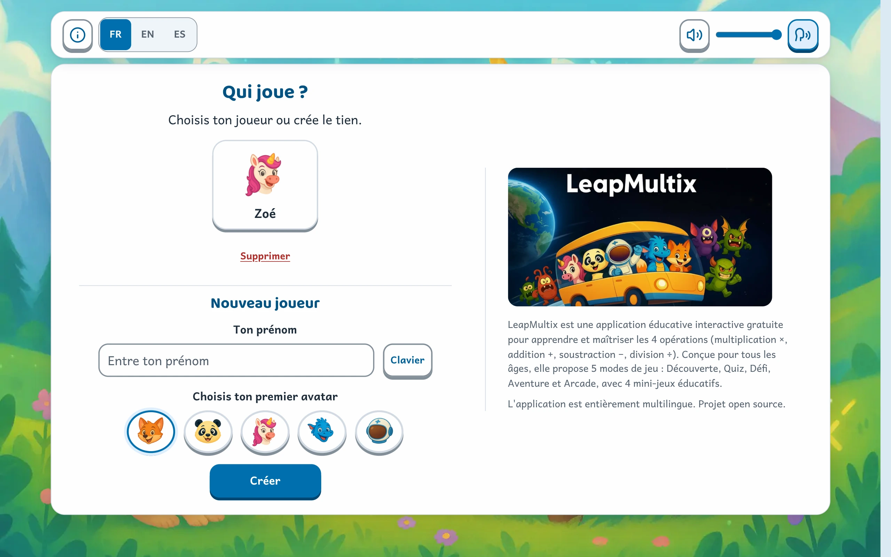
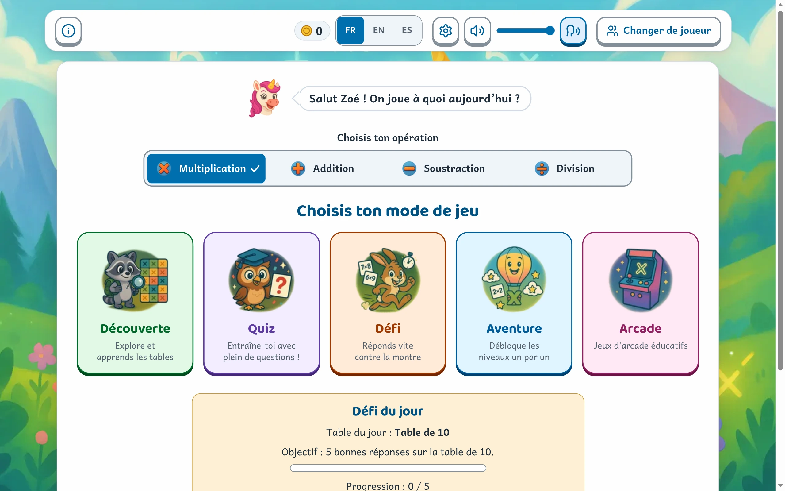
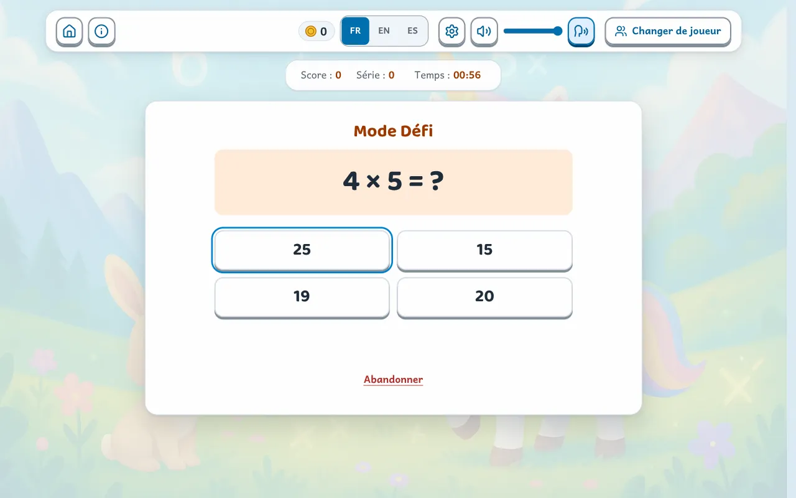
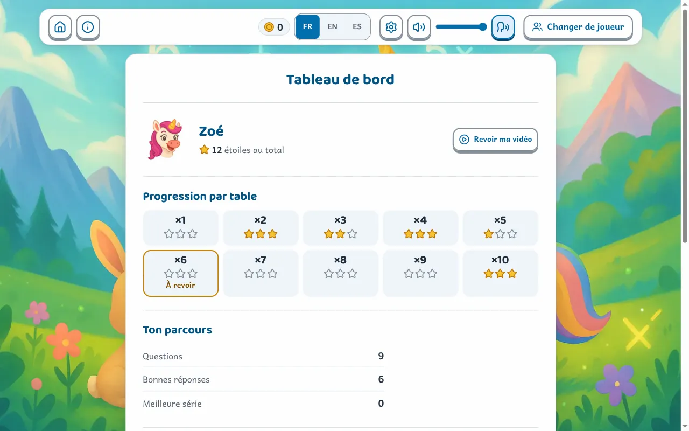
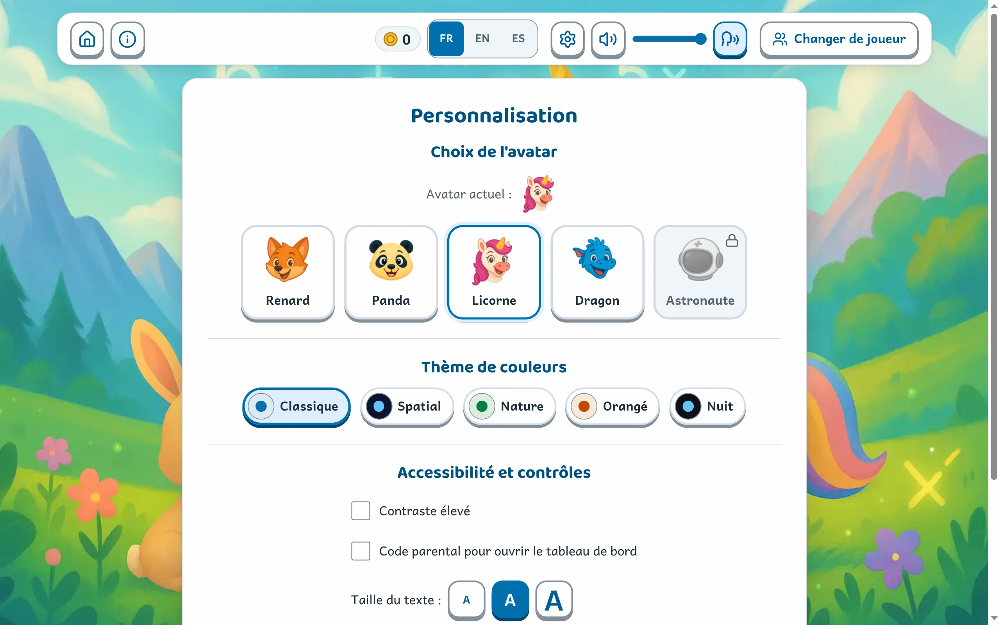
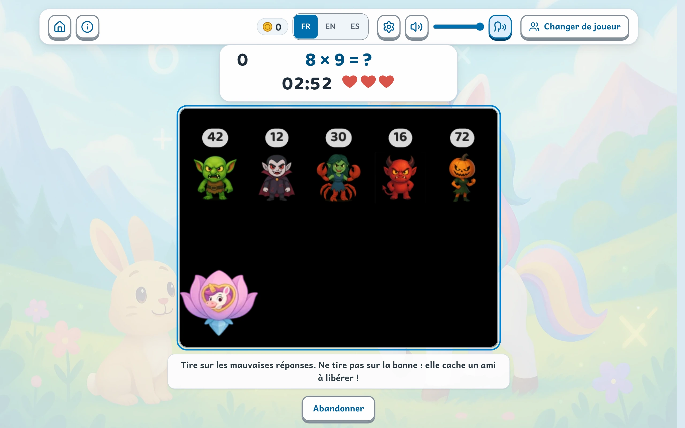
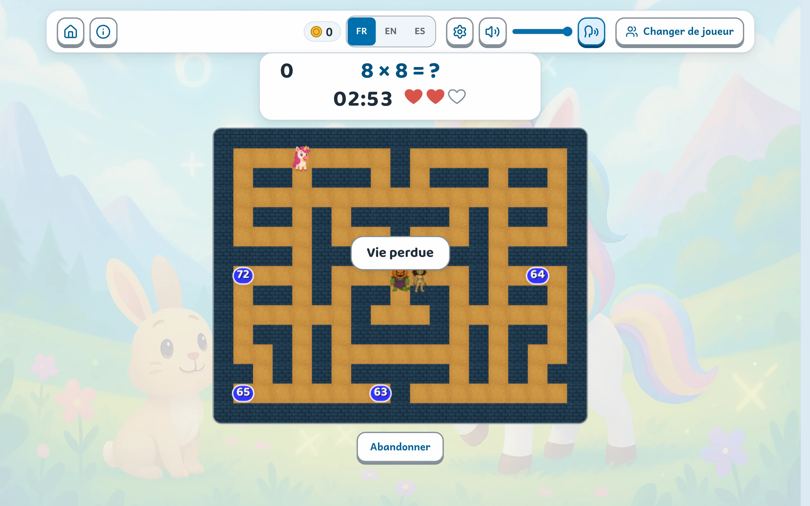
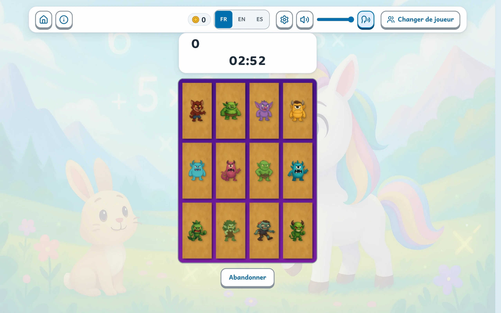
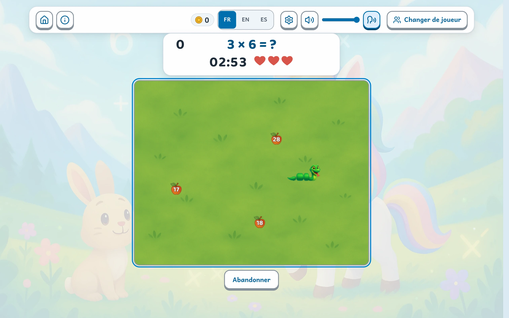

<details>
<summary>本文档也提供其他语言版本</summary>

- [英语](./README.en.md)
- [西班牙语](./README.es.md)
- [葡萄牙语](./README.pt.md)
- [德语](./README.de.md)
- [中文](./README.zh.md)
- [印地语](./README.hi.md)
- [阿拉伯语](./README.ar.md)
- [意大利语](./README.it.md)
- [瑞典语](./README.sv.md)
- [波兰语](./README.pl.md)
- [荷兰语](./README.nl.md)
- [罗马尼亚语](./README.ro.md)
- [日语](./README.ja.md)
- [韩语](./README.ko.md)

</details>

# LeapMultix


[](https://www.codefactor.io/repository/github/jls42/leapmultix)
[](https://app.codacy.com/gh/jls42/leapmultix/dashboard?utm_source=gh&utm_medium=referral&utm_content=&utm_campaign=Badge_grade)
[](https://sonarcloud.io/summary/new_code?id=jls42_leapmultix)

[](https://sonarcloud.io/summary/new_code?id=jls42_leapmultix)
[](https://sonarcloud.io/summary/new_code?id=jls42_leapmultix)
[](https://sonarcloud.io/summary/new_code?id=jls42_leapmultix)
[](https://sonarcloud.io/summary/new_code?id=jls42_leapmultix)

[](https://sonarcloud.io/summary/new_code?id=jls42_leapmultix)
[](https://sonarcloud.io/summary/new_code?id=jls42_leapmultix)
[](https://sonarcloud.io/summary/new_code?id=jls42_leapmultix)
[](https://sonarcloud.io/summary/new_code?id=jls42_leapmultix)
[](https://sonarcloud.io/summary/new_code?id=jls42_leapmultix)

## 目录

- [说明](#说明)
- [概览](#-概览)
- [功能](#-功能)
- [快速开始](#-快速开始)
- [架构](#-架构)
- [游戏模式详解](#-游戏模式详解)
- [开发](#-开发)
- [兼容性](#-兼容性)
- [本地化](#-本地化)
- [数据存储](#-数据存储)
- [报告问题](#-报告问题)
- [许可证](#-许可证)

## 说明

LeapMultix 是一款面向 6 至 12 岁儿童的交互式教育 Web 应用，帮助他们掌握乘法（×）、加法（+）、减法（−）和除法（÷）这 4 种算术运算。它通过直观、无障碍且支持多语言的界面，提供 **5 种游戏模式**和 **4 款街机小游戏**。

**多运算支持：**五种模式均支持四种运算。运算可在主屏幕上选择，并应用于整个学习流程。

**开发者：**Julien LS（contact@jls42.org）

**在线地址：**https://leapmultix.jls42.org/

## 📸 概览

### 界面

|                                                                        |                                                                                |
| :--------------------------------------------------------------------: | :----------------------------------------------------------------------------: |
|             |                          |
|       **谁在玩？**——每个孩子都有自己的个人资料、头像和学习进度。       |                   **菜单**——在此选择运算，然后进入五种模式。                   |
|       |    |
|  **探索**——每个等式都可通过圆点、跳跃或计数来展示，并附带乘法表技巧。  | **测验**——孩子选择的答案会继续显示在正确答案旁边，并通过说明详细解析计算过程。 |
|          |      |
|     **挑战**——与时间赛跑。答错时，计时器会暂停，以便阅读正确答案。     |                   **冒险**——十个关卡依次开放，并可赢取星星。                   |
|                      |         |
|              **街机**——四款小游戏，可设置难度并选择飞船。              |          **仪表板**——各乘法表的星星、需要复习的乘法表以及各模式得分。          |
|  |                                                                                |
|       **个性化**——头像、配色主题、文字大小、高对比度和家长代码。       |                                                                                |

### 街机小游戏

四款游戏都会提出同一道题——题目显示在游戏区域上方，同时还会显示剩余时间和生命数——但每款游戏要求的操作各不相同。

|                                                                                                        |                                                                              |
| :----------------------------------------------------------------------------------------------------: | :--------------------------------------------------------------------------: |
|                  |        |
|           **MultiInvaders**——射击错误答案，避开正确答案：正确答案中藏着一位等待解救的朋友。            |             **MultiMiam**——穿过迷宫捕捉正确结果，同时躲避怪物。              |
|  |  |
|                      **MultiMemory**——凭记忆找出哪张卡片上写着已翻开算式的结果。                       |           **MultiSnake**——吞下正确数字来成长，并避开其他所有数字。           |

## ✨ 功能

### 🎮 游戏模式

- **探索模式**：针对每种运算量身打造的可视化交互式探索
- **测验模式**：支持 4 种运算（×、+、−、÷）并具有自适应进度的选择题
- **挑战模式**：支持 4 种运算（×、+、−、÷）和不同难度等级的计时挑战
- **冒险模式**：支持 4 种运算的叙事式关卡进程

### 🕹️ 街机小游戏

- **MultiInvaders**：教育版 Space Invaders——消灭错误答案
- **MultiMiam**：数学版 Pac-Man——收集正确答案
- **MultiMemory**：记忆游戏——匹配运算和结果
- **MultiSnake**：教育版 Snake——吃下正确数字来成长

### ➕ 多运算支持

LeapMultix 在**所有模式**中提供完整的 4 种算术运算训练：

| 模式 | ×   | +   | −   | ÷   |
| ---- | --- | --- | --- | --- |
| 测验 | ✅  | ✅  | ✅  | ✅  |
| 挑战 | ✅  | ✅  | ✅  | ✅  |
| 探索 | ✅  | ✅  | ✅  | ✅  |
| 冒险 | ✅  | ✅  | ✅  | ✅  |
| 街机 | ✅  | ✅  | ✅  | ✅  |

### 🌍 通用功能

- **多用户**：管理个人资料并保存每位用户的学习进度
- **多语言**：支持法语、英语和西班牙语
- **个性化**：头像、配色主题和背景
- **无障碍**：键盘导航、触控支持，符合 WCAG 2.1 AA 标准
- **移动端响应式设计**：针对平板电脑和智能手机优化的界面
- **进度系统**：分数、徽章和每日挑战

## 🚀 快速开始

### 前置要求

- Node.js（16 或更高版本）
- 现代 Web 浏览器

### 安装

```bash
# Cloner le projet
git clone https://github.com/jls42/leapmultix.git
cd leapmultix

# Installer les dépendances
npm install

# Lancer le serveur de développement (option 1)
npm run serve
# L'application sera accessible sur http://localhost:8080 (ou port suivant disponible)

# Ou avec Python (option 2)
python3 -m http.server 8000
# L'application sera accessible sur http://localhost:8000
```

### 可用脚本

```bash
# Développement
npm run serve          # Serveur local (http://localhost:8080)
npm run lint           # Vérification du code avec ESLint
npm run lint:fix       # Correction automatique des problèmes ESLint
npm run format:check   # Vérifier le formatage du code (TOUJOURS avant commit)
npm run format         # Formater le code avec Prettier
npm run verify         # Quality gate: lint + test + coverage

# Tests
npm run test           # Lancer tous les tests (CJS)
npm run test:watch     # Tests en mode watch
npm run test:coverage  # Tests avec rapport de couverture
npm run test:core      # Tests des modules core uniquement
npm run test:integration # Tests d'intégration
npm run test:storage   # Tests du système de stockage
npm run test:esm       # Tests ESM (dossiers tests-esm/, Jest vm-modules)
npm run test:verbose   # Tests avec sortie détaillée
npm run test:pwa-offline # Test offline PWA (nécessite Puppeteer), après `npm run serve`

# Analyse et maintenance
npm run analyze:jsdoc  # Analyse de la documentation
npm run improve:jsdoc  # Amélioration automatique JSDoc
npm run audit:mobile   # Tests responsivité mobile
npm run audit:accessibility # Tests d'accessibilité
npm run dead-code      # Détection de code non utilisé
npm run analyze:globals # Analyse des variables globales
npm run analyze:dependencies # Analyse usage des dépendances
npm run verify:cleanup # Analyse combinée (dead code + globals)

# Gestion des assets
npm run assets:generate    # Générer les images responsives
npm run assets:backgrounds # Convertir les fonds en WebP
npm run assets:analyze     # Analyse des assets responsive
npm run assets:diff        # Comparaison des assets

# Internationalisation
npm run i18n:verify    # Vérifier la cohérence des clés de traduction
npm run i18n:unused    # Lister les clés de traduction non utilisées
npm run i18n:compare   # Comparer les traductions (en/es) avec fr.json (référence)

# Build & livraison
npm run build          # Build de prod (Rollup) + postbuild (dist/ complet)
npm run serve:dist     # Servir dist/ sur http://localhost:5000 (ou port disponible)

# PWA et Service Worker
npm run sw:disable     # Désactiver le service worker
npm run sw:fix         # Corriger les problèmes de service worker
```

## 🏗️ 架构

### 文件结构

JavaScript 模块**平铺在 `js/` 中**，只有三个目录例外：`core/`、`components/` 和 `modes/`。因此，文件名本身体现了所属分组（`arcade-*`、`multimiam-*`、`i18n*`……）。

```
leapmultix/
├── index.html              # Application (navigation par slides)
├── modes.html              # Page publique : les modes de jeu
├── parents.html            # Page publique : guide parents et enseignants
├── pwa.html                # Page publique : installation hors ligne
├── offline.html            # Page servie hors ligne par le service worker
├── sw.js                   # Service worker (version alignée sur js/cache-updater.js)
├── deploy.sh               # Déploiement S3 + invalidation CloudFront
├── js/
│   ├── core/               # Socle applicatif
│   │   ├── GameMode.js, GameModeManager.js   # Classe de base des modes
│   │   ├── storage.js, userState.js          # Persistance et session
│   │   ├── audio.js, theme.js, parental.js   # Son, thèmes, contrôle parental
│   │   ├── eventBus.js, mainInit.js          # Événements, amorçage DOM
│   │   ├── adventure-data.js                 # Niveaux du mode Aventure
│   │   ├── mult-stats.js, challenge-stats.js, operation-stats.js
│   │   ├── daily-challenge.js, tablePreferences.js, stats-migration.js
│   │   ├── userUi.js, utils.js               # Utilitaires (source canonique)
│   │   └── operations/                       # Une classe par opération
│   │       ├── Operation.js, OperationRegistry.js
│   │       └── Multiplication.js, Addition.js, Subtraction.js, Division.js
│   ├── components/         # Composants d'interface
│   │   ├── topBar.js, infoBar.js, dashboard.js, customization.js
│   │   ├── operationSelector.js, operationModeAvailability.js
│   │   └── icons.js, tableSettingsModal.js
│   ├── modes/              # Les cinq modes de jeu
│   │   ├── DiscoveryMode.js, QuizMode.js, ChallengeMode.js
│   │   └── AdventureMode.js, ArcadeMode.js
│   ├── arcade*.js          # Orchestrateur et briques communes des mini-jeux
│   ├── multimiam*.js       # Mini-jeu Pac-Man (moteur, rendu, contrôles…)
│   ├── multisnake.js       # Mini-jeu Snake
│   ├── i18n.js, i18n-store.js                # Internationalisation
│   ├── security-utils.js, error-handlers.js, logger.js
│   ├── accessibility.js, keyboard-navigation.js, touch-support.js, speech.js
│   ├── slides.js, mode-orchestrator.js, lazy-loader.js, game-cleanup.js
│   ├── VideoManager.js, responsive-image-loader.js
│   ├── userManager.js, main-helpers.js, utils-es6.js, questionGenerator.js
│   └── main-es6.js, main.js, bootstrap.js, game.js   # Points d'entrée
├── css/                    # Feuilles de style (jetons de design : themes.css)
├── assets/
│   ├── images/             # Sources PNG (avatars, sprites, fonds)
│   ├── generated-images/   # Variantes responsives (généré, hors git)
│   ├── fonts/, sounds/, videos/, icons/, social/
│   └── translations/       # fr.json, en.json, es.json
├── tests/__tests__/        # Tests Jest (jsdom, et bout-en-bout via Puppeteer)
├── tests-esm/              # Tests Jest en modules ES (.mjs)
├── scripts/                # Génération d'assets, i18n, rapports
├── docs/media/             # Captures et animations du README
└── dist/                   # Build de production (généré)
```

### 技术架构

**现代 ES6 模块**：项目采用模块化架构，使用 ES6 类和原生导入/导出。

**可复用组件**：界面使用集中管理的 UI 组件构建（TopBar、InfoBar、Dashboard、Customization）。

**Lazy Loading**：通过 `lazy-loader.js` 按需智能加载模块，以优化初始性能。

**统一存储系统**：通过 LocalStorage 和回退机制，使用集中式 API 持久化用户数据。

**集中式音频管理**：提供多语言支持和按用户保存偏好的声音控制。

**Event Bus**：组件之间通过解耦的事件通信实现易于维护的架构。

**幻灯片式导航**：基于编号幻灯片（slide0、slide1 等）并使用 `goToSlide()` 的导航系统。

**安全性**：所有 DOM 操作均通过 `security-utils.js` 实现 XSS 防护和清理。

## 🎯 游戏模式详解

### 探索模式

乘法表可视化探索界面，包括：

- 乘法的交互式可视化
- 动画和记忆提示
- 教育式拖放操作
- 按乘法表自由推进

### 测验模式

选择题功能包括：

- 每轮 10 道题
- 根据答题表现自适应调整进度
- 虚拟数字键盘
- 连续答对计数系统

### 挑战模式

计时挑战功能包括：

- 3 个难度等级（初级、中级、困难）
- 答对时获得时间奖励
- 生命系统
- 最高分排行榜

### 冒险模式

叙事式进程包括：

- 10 个可解锁的主题关卡
- 带有可视化进度的交互式地图
- 包含角色的沉浸式故事
- 星星与奖励系统

### 街机小游戏

每款小游戏均提供：

- 难度选择和个性化设置
- 生命与得分系统
- 键盘和触控操作
- 按用户划分的个人排行榜

## 🛠️ 开发

### 开发工作流程

**切勿直接向 main 提交。**项目通过功能分支开展工作。

**1. 创建分支**，功能使用 `feat/`，修复使用 `fix/`：

```bash
git checkout -b feat/nom-de-la-fonctionnalite
```

**2. 开发并检查。**格式检查优先执行：CI 会在运行测试之前拒绝格式不合格的代码。

```bash
npm run format:check  # TOUJOURS en premier : la CI refuse un code non formaté
npm run format        # Formater si nécessaire
npm run lint          # Qualité du code
npm run test          # Tests
npm run test:coverage # Couverture
```

**3. 在分支上提交**，然后推送：

```bash
git add .
git commit -m "feat: description de la fonctionnalité"
git push -u origin feat/nom-de-la-fonctionnalite
```

**4. 创建 pull request**并等待分析：verify、Codacy、CodeFactor 和 SonarCloud。所有检查均通过后再合并。

**提交风格**：消息应简洁并使用祈使语气（例如：“Fix arcade init errors”、“Refactor cache updater”）

**质量门禁**：确保每次提交前 `npm run lint`、`npm test` 和 `npm run test:coverage` 均通过

### 组件架构

**GameMode（基类）**：所有模式都继承自一个具有标准化方法的公共类。

**GameModeManager**：集中协调各模式的启动和管理。

**UI 组件**：TopBar、InfoBar、Dashboard 和 Customization 提供一致的界面。

**Lazy Loading**：按需加载模块以优化初始性能。

**Event Bus**：通过事件系统实现组件之间的解耦通信。

### 测试

项目包含完整的测试套件：

- core 模块的单元测试
- 组件集成测试
- 游戏模式测试
- 自动化代码覆盖率统计

```bash
npm test              # Tous les tests (CJS)
npm test:core         # Tests des modules centraux
npm test:integration  # Tests d'intégration
npm test:coverage     # Rapport de couverture
npm run test:esm      # Tests ESM (ex: components/dashboard) via vm-modules
```

### 生产构建

- **Rollup**：将 `js/main-es6.js` 打包为 ESM，并支持代码拆分和 sourcemap
- **Terser**：自动压缩以优化性能
- **构建后处理**：复制 `css/` 和 `assets/`、favicon（`favicon.ico`、`favicon.png`、`favicon.svg`）、`sw.js`，并将 `dist/index.html` 重写为带哈希的入口文件（例如 `main-es6-*.js`）
- **最终目录**：`dist/`，可直接作为静态内容提供

```bash
npm run build      # génère dist/
npm run serve:dist # sert dist/ (port 5000)
```

### 持续集成

**GitHub Actions**：`.github/workflows/ci.yml`，在每次推送到 `main` 以及每次 pull request 时触发。

**`verify`**——具有阻断作用的质量门禁：

- `npm ci`，然后是 `npm run verify`（ESLint、Jest 测试、覆盖率）
- `npm run format:check`（Prettier）

**`seo-report`**——在 `verify` 之后：对在线网站执行 Lighthouse 审计，以长期跟踪 SEO 指标。

**连接至 pull request 的外部分析工具**：Codacy、CodeFactor 和 SonarCloud。SonarCloud 门禁要求新代码在可靠性、安全性和可维护性方面均获得 A 级。

**部署**：`./deploy.sh` 将网站同步至 S3 并使 CloudFront 缓存失效。该脚本会在需要时重新生成 git 中未包含的响应式图片。

### PWA（Progressive Web App）

LeapMultix 是一款完整的 PWA，支持离线使用和安装。

**Service Worker**（`sw.js`）：

- 导航：优先使用网络，并以 `offline.html` 作为离线回退
- 图片：优先使用缓存以优化性能
- 翻译：使用 Stale-while-revalidate 在后台更新
- JS/CSS：优先使用网络，以始终提供最新版本
- 通过 `cache-updater.js` 自动管理版本

**Manifest**（`manifest.json`）：

- 适用于所有设备的 SVG 和 PNG 图标
- 可安装到移动设备（添加到主屏幕）
- 使用 standalone 配置提供类似原生应用的体验
- 支持主题和颜色

**在本地测试离线模式。**启动服务器，然后打开 `http://localhost:8080`（或显示的端口）：

```bash
npm run serve
```

手动测试：在开发者工具中断开网络（“网络”选项卡，离线模式），然后刷新页面。此时应显示 `offline.html`。

使用 Puppeteer 自动测试：

```bash
npm run test:pwa-offline
```

**Service Worker 管理脚本**：

```bash
npm run sw:disable  # Désactiver le service worker
npm run sw:fix      # Corriger les problèmes de cache
```

### 质量标准

**代码质量工具**：

- **ESLint**：采用 flat config（`eslint.config.js`）的现代配置，支持 ES2022
- **Prettier**：自动格式化代码（`.prettierrc`）
- **Stylelint**：CSS 验证（`.stylelintrc.json`）
- **JSDoc**：自动生成函数文档并分析覆盖率

**重要代码规则**：

- 删除未使用的变量和参数（`no-unused-vars`）
- 使用明确的错误处理方式（禁止空 catch）
- 避免使用 `innerHTML`，改用 `security-utils.js` 函数
- 函数的认知复杂度保持在 15 以下
- 将复杂函数拆分为更小的辅助函数

**安全性**：

- **XSS 防护**：使用 `security-utils.js` 中的函数：
  - 使用 `appendSanitizedHTML()`，而非 `innerHTML`
  - 使用 `createSafeElement()` 创建安全元素
  - 使用 `setSafeMessage()` 设置文本内容
- **外部脚本**：必须添加 `crossorigin="anonymous"` 属性
- **输入验证**：始终清理外部数据
- **Content Security Policy**：使用 CSP 标头限制脚本来源

**无障碍**：

- 符合 WCAG 2.1 AA 标准
- 完整的键盘导航
- 适当的 ARIA 角色和标签
- 符合标准的颜色对比度

**性能**：

- 通过 `lazy-loader.js` 实现模块的 Lazy Loading
- CSS 优化和响应式资源
- 使用 Service Worker 实现智能缓存
- 在生产环境中进行代码拆分和压缩

## 📱 兼容性

### 支持的浏览器

界面使用 `oklch()` 处理颜色，并使用 `:has()` 处理上下文状态，因此最低要求如下：

- Chrome / Chromium 111+
- Edge 111+
- Firefox 121+
- Safari 15.4+

### 设备

- **桌面设备**：键盘和鼠标控制
- **平板电脑**：优化的触控界面
- **智能手机**：自适应响应式设计

### 无障碍功能

- 完整的键盘导航（Tab、方向键、Esc）
- 供屏幕阅读器使用的 ARIA 角色和标签
- 符合规范的颜色对比度
- 支持辅助技术

## 🌍 本地化

全面支持多种语言：

- **法语**（默认语言）
- **英语**
- **西班牙语**

### 翻译管理

**翻译文件：** `assets/translations/*.json`

**格式：**

```json
{
  "menu_start": "Commencer",
  "quiz_correct": "Bravo !",
  "arcade_invasion_title": "MultiInvaders"
}
```

### i18n 管理脚本

**`npm run i18n:verify`** - 检查翻译键的一致性

**`npm run i18n:unused`** - 列出未使用的翻译键

**`npm run i18n:compare`** - 将翻译文件与 fr.json（参考文件）进行比较

此脚本（`scripts/compare-translations.cjs`）确保所有语言文件保持同步：

**功能：**

- 检测缺失的键（存在于 fr.json 中，但不存在于其他语言中）
- 检测多余的键（存在于其他语言中，但不存在于 fr.json 中）
- 识别空值（`""`、`null`、`undefined`、`[]`）
- 检查类型一致性（string 与 array）
- 将嵌套的 JSON 结构扁平化为点号表示法（例如：`arcade.multiMemory.title`）
- 生成详细的控制台报告
- 将 JSON 报告保存到 `docs/translations-comparison-report.json`

**输出示例：**

```
🔍 Analyse comparative des fichiers de traduction

📚 Langue de référence: fr.json
✅ fr.json: 570 clés

━━━━━━━━━━━━━━━━━━━━━━━━━━━━━━━━━━━━━━━━
📝 Analyse de en.json
━━━━━━━━━━━━━━━━━━━━━━━━━━━━━━━━━━━━━━━━

📊 Total de clés: 570
✅ Aucune clé manquante
✅ Aucune clé supplémentaire
✅ Aucune valeur vide

📊 RÉSUMÉ FINAL
  fr.json: 570 clés
  en.json: 570 clés
  es.json: 570 clés

✅ Tous les fichiers de traduction sont parfaitement synchronisés !
```

**翻译覆盖范围：**

- 完整的用户界面
- 游戏说明
- 错误和反馈消息
- 说明和上下文帮助
- 冒险模式的叙事内容
- 无障碍标签和 ARIA

## 📊 数据存储

### 用户数据

- 个人资料和偏好设置
- 各游戏模式的进度
- 街机游戏的分数和统计数据
- 个性化设置

### 技术功能

- 带后备机制的本地存储（localStorage）
- 按用户隔离数据
- 自动保存进度
- 自动迁移旧数据

## 🐛 报告问题

可以通过 GitHub issues 报告问题。请提供：

- 问题的详细说明
- 重现步骤
- 浏览器及其版本
- 相关的屏幕截图

## 💝 支持项目

**[☕ 通过 PayPal 捐赠](https://paypal.me/jls)**

## 📄 许可证

本项目采用 AGPL v3 许可证。更多详情请参阅 `LICENSE` 文件。

---

_LeapMultix——用于学习四则运算的自由教育应用程序_
